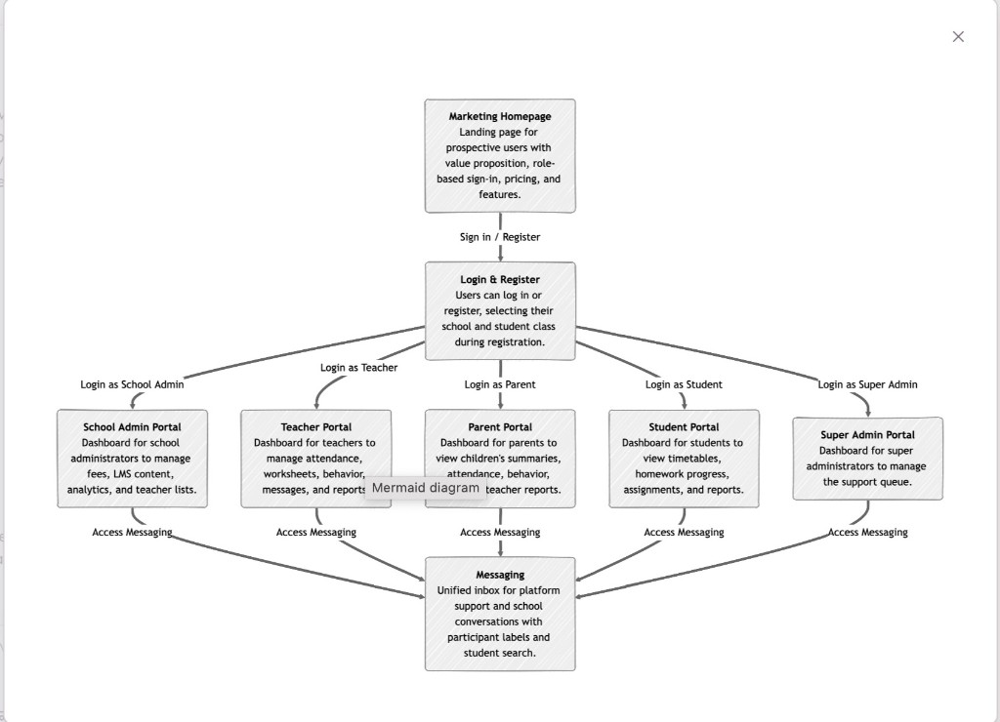
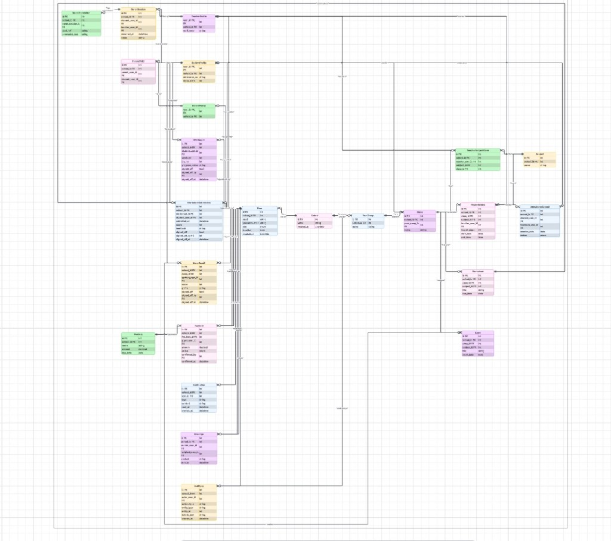

# ESA — Education and Schooling Applications

**ESA (Education and Schooling Applications)** is a full-stack multi-tenant SaaS platform for Islamic schools. It helps staff manage admissions, learning, attendance, academic progress, teacher-verified sign-offs, messaging, and payments (including Stripe Connect payouts to schools) in one place.

> **Live app:** https://esa-project-2a7a33dfe3fc.herokuapp.com/ · **Source:** https://github.com/sadek17481748/ESA  
> Static wireframe HTML at the repo root (`*.html`, `css/base.css`) can still be previewed with `python3 -m http.server 8080` — the production UI is implemented as Django templates.

## Table of Contents

- [Overview](#overview)
  - [Project goals](#project-goals)
  - [Planning notes (written at project start)](#planning-notes-written-at-project-start)
- [Quick links](#quick-links)
- [Key UI screenshots](#key-ui-screenshots)
- [Features](#features)
- [User Experience (UX)](#user-experience-ux)
  - [Responsive behaviour](#responsive-behaviour)
  - [How responsiveness was tested](#how-responsiveness-was-tested)
  - [User stories](#user-stories)
- [Wireframes](#wireframes)
  - [Wireframe inventory](#wireframe-inventory)
- [Design](#design)
  - [Data model and ERD (entity relationships)](#data-model-and-erd-entity-relationships)
  - [Visual language](#visual-language)
  - [Colour palette](#colour-palette)
  - [Typography](#typography)
  - [Accessibility](#accessibility)
- [Technologies Used](#technologies-used)
- [File Structure](#file-structure)
- [Development](#development)
  - [Project setup from scratch (Django)](#project-setup-from-scratch-django)
  - [GitHub setup and version control](#github-setup-and-version-control)
  - [Local setup](#local-setup)
  - [Environment variables](#environment-variables)
  - [Run locally](#run-locally)
- [Deployment](#deployment)
  - [GitHub and Heroku integration](#github-and-heroku-integration)
  - [Deployment steps](#deployment-steps)
  - [Connecting Gmail for platform email notifications](#connecting-gmail-for-platform-email-notifications)
- [Testing and Bugs](#testing-and-bugs)
  - [Testing strategy and plan](#testing-strategy-and-plan)
  - [Assessment test matrix](#assessment-test-matrix)
  - [Manual testing](#manual-testing)
  - [Automated testing](#automated-testing)
  - [Testing summary table](#testing-summary-table)
  - [Bugs encountered during development](#bugs-encountered-during-development)
  - [Use of AI (assistance log)](#use-of-ai-assistance-log)
  - [Lighthouse testing](#lighthouse-testing)
  - [HTML, CSS and JS validation](#html-css-and-js-validation)
- [Security](#security)
- [Sources and references](#sources-and-references)
- [Sprint delivery evidence (June–July 2025)](#sprint-delivery-evidence-junejuly-2025)
  - [Portal login hub](#portal-login-hub-introduction)
  - [Login credentials by role](#super-admin-login-credentials)
  - [Quick navigation links](#quick-navigation-links)
  - [Qur'an annotation sprint (19–23 June)](#quran-sprint-overview-1923-june)
  - [Exams and sign-off sprint (24–28 June)](#exams-sprint-overview-2428-june)
  - [Payments and deployment sprint (29 June–1 July)](#payments-sprint-overview-29-june1-july)
  - [User acceptance testing](#user-acceptance-testing-overview)
  - [Design inspiration (videos and websites)](#design-inspiration--islamic-school-platforms)
  - [Deployment readiness checklist](#deployment-readiness--heroku-platform)
  - [Systems used summary](#systems-used--technology-summary)
  - [Closing assessor guide](#closing-assessor-guide)
- [Author](#author)

---

## Quick links

Assessor-facing links and evidence paths:

| Resource | Link or path |
|----------|--------------|
| **Source repository** | https://github.com/sadek17481748/ESA |
| **Live deployment** | https://esa-project-2a7a33dfe3fc.herokuapp.com/ |
| **Bug tracker (GitHub Project board)** | https://github.com/users/sadek17481748/projects/8/views/1 |
| **Wireframes (README anchor)** | [Wireframes](#wireframes) · [PDF pack](docs/ESA-wireframes.pdf) · [Balsamiq](https://balsamiq.cloud/so6babk/pveanf2) |
| **ERD / data model** | [Data model and ERD](#data-model-and-erd-entity-relationships) |
| **Test credentials** | `schooladmin` / `admin1234`, `parent_demo` / `demo1234`, `teacher_demo` / `teacher1234` — run `seed_rbac_users` on Heroku |
| **Manual test evidence (screenshots)** | `docs/images/manual-testing/` |
| **Validation evidence** | `docs/images/validation/` |
| **Sprint checklist** | Follow the delivery timeline under [Planning notes](#planning-notes-written-at-project-start) |

### Demo walkthrough

A short assessor path on the live site:

1. Open the [live deployment](https://esa-project-2a7a33dfe3fc.herokuapp.com/) and browse the home carousel.
2. Log in as `schooladmin` / `admin1234` — confirm the School Admin dashboard and sidebar links load.
3. Log out, then log in as `parent_demo` / `demo1234` — open **Payments** and confirm only that parent's fees appear.
4. Log in as `teacher_demo` / `teacher1234` — open **Attendance** or **Homework** and confirm teacher-only actions are visible.
5. Log in as `super` / `super1234` — confirm the Super Admin schools overview is reachable.

---

## Overview

ESA is designed for multiple schools (tenants) with strict data isolation, role-based access control, JWT-ready APIs (Django REST Framework), and a mobile-responsive dashboard. **Teacher sign-off** is a core trust layer: Hifz progress, homework/worksheets, and exam results only become official after an authenticated teacher verifies them (with re-authentication on sign-off and audit logging planned alongside implementation).

Planned core roles:

- **Super Admin**: manage schools, platform-wide settings, subscriptions, and analytics.
- **School Admin**: manage staff/students/parents, set fees, and connect Stripe for payouts.
- **Teacher**: manage classes/subjects, attendance, homework, exams, and progress sign-offs.
- **Student**: view timetable/work and submit recordings and assignments.
- **Parent**: monitor progress and payments, and make payments.

### Project goals

1. **Full-stack Django application** — Build a production-quality Django project following the Model-View-Template (MVT) pattern, backed by a relational PostgreSQL database. Each major feature area (accounts, schools, hifz, payments, etc.) lives in its own reusable Django app so the codebase stays modular and testable.

2. **Multi-tenant architecture** — Every school operates as an isolated tenant. All database queries are scoped to the authenticated user's school so that no data ever leaks between institutions. Tenant isolation is enforced at the model-manager level and verified with automated tests.

3. **Role-based access control (RBAC)** — Five distinct roles (Super Admin, School Admin, Teacher, Student, Parent) each have explicit permissions. Views, API endpoints, and templates all check the user's role before granting access, ensuring that a student can never reach a teacher-only page and a School Admin from one school can never see another school's data.

4. **End-to-end CRUD with immediate UI feedback** — Users can create, read, update, and delete records (students, assignments, attendance marks, fee items, etc.) and see changes reflected in the interface immediately. Form validation is handled server-side with clear inline error messages, and success feedback is shown after every action.

5. **Teacher sign-off as a trust layer** — Hifz completion, homework approval, and exam finalisation all require an authenticated teacher to explicitly sign off. Sign-off actions demand password re-entry, generate an AuditLog record, and are the only pathway for progress data to appear on student and parent reports. This prevents self-reporting and ensures data integrity.

6. **Stripe Connect payment routing** — School Admins connect their institution's Stripe account via OAuth. Parent fee payments are processed through Stripe Checkout and routed directly to the school's connected account, with an optional platform commission. Webhooks confirm payment status and trigger receipt generation.

7. **Responsive, accessible UI** — All pages are designed mobile-first using a black, white, and gold colour palette with subtle Arabic geometric motifs. The interface targets WCAG AA contrast ratios, full keyboard navigation, and semantic HTML so it is usable on phones, tablets, and desktops by all users.

8. **Incremental, well-documented development** — The project follows a detailed weekly delivery timeline. Each feature is committed in small, reviewable steps with conventional commit messages. The README, inline documentation, and test suite grow alongside the code so the full development journey is visible to assessors.

### Planning notes (written at project start)

This section captures the early plan in plain language to keep scope clear while building step-by-step.

#### Architecture notes (initial)

- Multi-tenant: each record belongs to a `School` tenant; all queries are scoped to the authenticated user's tenant.
- Auth: JWT-based authentication for API and role-based permissions for views/actions.
- RBAC: explicit roles and permission checks (Super Admin vs School Admin vs Teacher vs Student vs Parent).

#### Delivery timeline (May 10 → July 1)

The goal is to have the application in a stable, deployable state by **July 1**, leaving **July 1 → July 7** as buffer for final polish, assessor checks, and contingency.

- **May 10 – May 14 (Foundation)**
  - Create Django project + settings (env-based config, Postgres, static/media structure).
  - Add core apps scaffolding (`accounts`, `schools`, etc.) and baseline URL structure.
  - Create custom user model and authentication foundations (JWT).
  - Establish tenant model (`School`) and a consistent way to scope data to a school.

- **May 15 – May 21 (RBAC + tenant isolation)**
  - Define roles and permission strategy (Super Admin / School Admin / Teacher / Student / Parent).
  - Implement permission checks and tenant query scoping in DRF and template views.
  - Add audit logging foundations for sensitive actions.

- **May 22 – May 28 (School setup flows)**
  - School Admin can create/manage teachers, students, parents (CRUD).
  - Year groups / classes models and assignment flows.
  - Bulk student import (CSV) initial version.

- **May 29 – June 4 (Subjects + timetable)**
  - Custom subjects per school (Hifz / Alimiyah / General) + teacher assignment.
  - Timetable creation and student/teacher views.
  - Attendance tracking basics linked to timetable/class.

- **June 5 – June 11 (Homework + worksheets + sign-off)**
  - Homework/worksheet assignment and submission flows.
  - Teacher sign-off verification: approve/reject submissions with secure server-side rules.
  - Notifications for assignments and sign-off outcomes (in-app first).

- **June 12 – June 18 (Hifz tracking + sign-off)**
  - Hifz records (status: Not Started / In Progress / Completed only via sign-off).
  - Smart revision suggestions (basic rules first, improve iteratively).
  - Teacher sign-off flow with re-auth requirement (password re-entry).

- **June 19 – June 23 (Qur'an annotation system)**
  - Qur'an text display and per-student session annotation model.
  - Mistake tagging (Tajweed / Memorisation / Fluency), timestamps, comments.
  - Audio upload and playback for recitations + teacher audio feedback.

- **June 24 – June 28 (Exams + sign-off finalisation)**
  - Exam creation (MCQ auto-mark + written/manual).
  - Results with "finalised" teacher sign-off requirement before being official.
  - Parent/student reporting views show only verified/finalised outcomes where required.

- **June 29 – July 1 (Payments + deployment-ready pass)**
  - Fees: pending vs completed payments, parent payment journey.
  - Stripe Connect onboarding for schools + payment routing to school accounts (platform fee optional).
  - Webhooks + receipts (PDF basic) + overdue reminders (email + in-app).
  - Stabilisation: permissions review, tenant isolation review, and deployment checklist.

**July 1 – July 7 (Buffer)**

- Full regression testing and bug fixes.
- Evidence collection (screenshots, test runs, validation, deployment notes).
- README expansion (data schema, deployment steps, testing evidence, assessor quick links).

#### Build order (high level)

- Project setup (Django + DRF) and configuration for Postgres + environment variables.
- Custom user model and authentication foundations.
- Tenant model (`School`) + isolation rules.
- Core learning flows: subjects, timetables, attendance.
- Progress systems: Hifz tracking + verification sign-off, worksheets, exams.
- Payments: fees, pending/completed payments, Stripe Connect payout flow.
- Notifications + messaging.
- Analytics dashboards.

---

## Key UI screenshots

Screenshots will be stored under `docs/images/manual-testing/` so key screens are visible directly in this README.

| Screen | Screenshot |
|--------|------------|
| Landing page | https://esa-project-2a7a33dfe3fc.herokuapp.com/ |
| Login | https://esa-project-2a7a33dfe3fc.herokuapp.com/ |
| Super Admin dashboard | https://esa-project-2a7a33dfe3fc.herokuapp.com/ |
| School Admin dashboard | https://esa-project-2a7a33dfe3fc.herokuapp.com/ |
| Teacher dashboard | https://esa-project-2a7a33dfe3fc.herokuapp.com/ |
| Student dashboard | https://esa-project-2a7a33dfe3fc.herokuapp.com/ |
| Parent dashboard | https://esa-project-2a7a33dfe3fc.herokuapp.com/ |
| Timetable | https://esa-project-2a7a33dfe3fc.herokuapp.com/ |
| Attendance register | https://esa-project-2a7a33dfe3fc.herokuapp.com/ |
| Hifz progress | https://esa-project-2a7a33dfe3fc.herokuapp.com/ |
| Payments / fees | https://esa-project-2a7a33dfe3fc.herokuapp.com/ |

---

## Features

- **Multi-tenant schools** — each school is a fully isolated tenant.
- **RBAC (roles + permissions)** — five roles with explicit permission checks.
- **Custom subjects per school** — Hifz, Alimiyah, General categories.
- **Timetable system** — weekly grid with conflict detection.
- **Attendance tracking** — per-session register with absence flagging.
- **Hifz tracking** — surah/juz progress with teacher sign-off.
- **Qur'an annotation** — recitation tagging (Tajweed / Memorisation / Fluency) with audio.
- **Teacher sign-off verification** — Hifz, worksheets, and exams require authenticated sign-off.
- **Payments with Stripe Connect** — fees routed directly to school bank accounts.
- **Notifications (email + in-app)** — assignment alerts, absence alerts, overdue fees.
- **Messaging** — teacher–parent direct messaging.
- **Analytics dashboards** — attendance rates, Hifz progress, fee collection.

---

## User Experience (UX)

### Responsive behaviour

The UI is designed mobile-first. Navigation collapses to a hamburger menu on small screens, dashboard cards stack vertically, and data tables scroll horizontally. Touch targets meet the 44x44px minimum on mobile viewports.

### How responsiveness was tested

| Device class | Typical width | What was checked |
|--------------|---------------|------------------|
| **Phone** | ~375px (portrait) | Hamburger menu, single-column stacking, readable text, usable buttons |
| **Tablet** | ~768px–834px | Grid layout transitions, navigation balance, form usability |
| **Laptop** | ~1024px–1280px | Multi-column grids, sidebar navigation, dashboard readability |
| **Desktop** | 1440px+ | Content respects max-width, tables use extra space, no awkward stretching |

Responsiveness testing evidence screenshots will be added to `docs/images/validation/`.

### User stories

#### Super Admin stories

**US-1 — Create and manage school tenants**
As a Super Admin, I want to create new school tenants and configure their basic details (name, address, contact email, subscription tier) so that each institution has its own isolated workspace on the platform.

Acceptance criteria:
- Super Admin can create a school from a form with required fields (name, address, contact email).
- Each new school is assigned a unique tenant ID that scopes all future data to that school.
- The school appears in the Super Admin's school list immediately after creation.
- Super Admin can edit the school's name, address, contact email, and subscription tier from the school detail page.

**US-2 — View platform-wide analytics**
As a Super Admin, I want to view a platform-level dashboard showing total schools, total active users, monthly revenue, and recent sign-ups so that I can monitor the overall health of the platform at a glance.

Acceptance criteria:
- Dashboard displays total school count, total active user count, and monthly revenue figure.
- A recent sign-ups list shows the last 10 schools created with their creation date.
- Data refreshes each time the page is loaded.

**US-3 — Manage subscriptions and billing**
As a Super Admin, I want to assign and change subscription tiers for each school so that billing is accurate and the platform remains financially sustainable.

Acceptance criteria:
- Super Admin can select a tier (e.g. Free, Standard, Premium) per school.
- Changing a tier is logged with a timestamp for audit purposes.
- Schools on an expired or suspended tier see a visual indicator on the Super Admin dashboard.

**US-4 — Suspend or deactivate a school**
As a Super Admin, I want to suspend or deactivate a school tenant so that I can enforce terms of service or handle non-payment without permanently deleting data.

Acceptance criteria:
- Super Admin can set a school's status to Active, Suspended, or Deactivated.
- Users belonging to a Suspended school see a message explaining access is temporarily restricted on login.
- Users belonging to a Deactivated school cannot log in at all.
- Data is retained (not deleted) when a school is suspended or deactivated.

**US-5 — Search and filter across schools and users**
As a Super Admin, I want to search and filter across all schools and users by name, email, or role so that I can provide support or investigate issues quickly.

Acceptance criteria:
- A search bar on the Super Admin users page accepts free-text input and returns matching users across all tenants.
- Results can be filtered by role (School Admin, Teacher, Student, Parent).
- Each result row shows the user's name, email, role, and school name.

---

#### School Admin stories

**US-6 — Add, edit, and remove teacher accounts**
As a School Admin, I want to add new teacher accounts, edit their details, and remove them when they leave so that my staffing records are always current.

Acceptance criteria:
- School Admin can create a teacher account with name, email, and subject assignments.
- School Admin can edit a teacher's name, email, or assigned subjects from the teacher detail page.
- School Admin can deactivate (soft-delete) a teacher account; the teacher can no longer log in but historical records (attendance, sign-offs) are preserved.
- Only teachers belonging to this school are visible; no cross-tenant leakage.

**US-7 — Enrol students individually or via CSV**
As a School Admin, I want to enrol students one at a time through a form or in bulk via CSV upload so that onboarding at the start of each term is efficient.

Acceptance criteria:
- A single-student form collects name, date of birth, year group, and parent email.
- A CSV upload accepts columns: first_name, last_name, date_of_birth, year_group, parent_email.
- Validation errors (missing fields, duplicate emails) are reported per row; valid rows are imported.
- Successfully enrolled students appear in the student list immediately.

**US-8 — Invite parents and link them to children**
As a School Admin, I want to invite parents by email and link each parent to one or more children so that parents can access the parent portal and see only their own children's data.

Acceptance criteria:
- School Admin enters a parent's email and selects the child(ren) to link.
- The parent receives an invitation email with a registration link.
- After registration the parent's dashboard shows only the linked children.
- A parent can be linked to multiple children; a child can have up to two linked parent accounts.

**US-9 — Create year groups and classes**
As a School Admin, I want to create year groups (e.g. Year 1, Year 2) and classes within each year group so that students and teachers can be organised by cohort.

Acceptance criteria:
- School Admin can create a year group with a name and academic year.
- Within a year group, School Admin can create one or more classes with a class name and capacity.
- Students can be assigned to a class; a student belongs to exactly one class at a time.
- Teachers can be assigned to classes they will teach.

**US-10 — Define custom subjects**
As a School Admin, I want to define the subjects taught at my school (selecting from categories such as Hifz, Alimiyah, and General) and give each a display name so that the curriculum reflects my school's specific programme.

Acceptance criteria:
- School Admin can add a subject with a category (Hifz / Alimiyah / General) and a custom display name.
- Subjects are scoped to the school; other schools cannot see them.
- School Admin can edit or archive a subject (archiving hides it from new assignments but preserves historical data).

**US-11 — Assign teachers to subjects and classes**
As a School Admin, I want to assign teachers to subjects and to specific classes so that the timetable can be built correctly and teachers only see data for their assigned classes.

Acceptance criteria:
- School Admin can select a teacher and assign them to one or more subject–class combinations.
- The teacher's timetable and class list update to reflect the assignment.
- Teachers cannot access classes or subjects they are not assigned to.

**US-12 — Build and publish a weekly timetable**
As a School Admin, I want to build a weekly timetable by assigning subject–teacher–class combinations to time slots so that staff, students, and parents know the schedule.

Acceptance criteria:
- A grid interface shows days (Monday–Friday) and configurable time slots.
- School Admin can drag or select a subject–teacher–class combination into a slot.
- Conflicts (same teacher in two places, same class double-booked) are flagged before saving.
- Published timetable is visible to teachers, students, and parents belonging to the relevant classes.

**US-13 — Set fee structures and due dates**
As a School Admin, I want to create fee items (tuition, trips, resources) with amounts and due dates so that parents know exactly what they owe and when.

Acceptance criteria:
- School Admin can create a fee item with a name, amount, due date, and target group (whole school, year group, or individual student).
- Fee items appear on the parent's outstanding fees list.
- Overdue fees are visually flagged with the number of days past due.

**US-14 — Connect the school's Stripe account**
As a School Admin, I want to connect my school's bank account via Stripe Connect onboarding so that fee payments from parents are routed directly to our school's account.

Acceptance criteria:
- A "Connect with Stripe" button initiates the Stripe Connect OAuth flow.
- On successful connection the school's Stripe account ID is stored and the dashboard shows a "Connected" badge.
- If the connection is incomplete or revoked, the dashboard shows a warning and payments cannot be processed until reconnected.

**US-15 — View attendance summaries and flag persistent absences**
As a School Admin, I want to view attendance summaries per class and per student, with automatic flagging of students whose attendance drops below a configurable threshold, so that pastoral concerns are caught early.

Acceptance criteria:
- An attendance overview page shows each class's attendance percentage for the current term.
- Drilling into a class shows per-student attendance percentages.
- Students below the threshold (default 90%) are highlighted in red.
- School Admin can adjust the threshold percentage in school settings.

**US-16 — Review behaviour incident logs**
As a School Admin, I want to view and filter all behaviour incident logs across the school so that I have oversight of student conduct and can identify patterns.

Acceptance criteria:
- A behaviour log page lists all incidents with date, student name, teacher who logged it, category, and description.
- Filters allow narrowing by date range, class, student, or severity.
- School Admin can add a follow-up note to any incident.

**US-17 — View school-wide analytics**
As a School Admin, I want to view school-wide analytics covering attendance rates, Hifz completion progress, homework submission rates, exam averages, and fee collection totals so that I can report to governors and make informed decisions.

Acceptance criteria:
- A school analytics page shows key metrics: overall attendance %, Hifz completion %, homework on-time %, average exam score, total fees collected vs outstanding.
- Each metric can be filtered by year group or class.
- Data only includes teacher-verified (signed-off) records where applicable.

**US-18 — Send announcements**
As a School Admin, I want to send announcements to all parents, to a specific year group, or to a specific class so that communication is centralised and parents receive important updates.

Acceptance criteria:
- School Admin composes a message with a subject line and body.
- School Admin selects the audience: all parents, a year group, or a class.
- Recipients receive an in-app notification and optionally an email.
- Sent announcements are logged in a sent-items list visible to School Admin.

---

#### Teacher stories

**US-19 — View my timetable and assigned classes**
As a Teacher, I want to see my personal timetable showing which classes I teach and when so that I know where I need to be each day.

**US-20 — Take a class register**
As a Teacher, I want to take a class register at the start of each lesson by marking each student as present, late, or absent so that attendance is recorded in real time.

**US-21 — Create and assign homework or worksheets**
As a Teacher, I want to create homework or worksheet assignments with a title, description, optional file attachment, and due date, and assign them to a class so that students know what to complete and by when.

**US-22 — Review and approve or reject student submissions**
As a Teacher, I want to review each student's homework or worksheet submission, leave feedback, and mark it as approved or rejected so that the student receives clear, recorded feedback.

**US-23 — Sign off Hifz progress**
As a Teacher, I want to sign off a student's Hifz progress for a specific surah or juz, moving its status from In Progress to Completed, so that completion is verified and trustworthy.

**US-24 — Re-authenticate before signing off**
As a Teacher, I want to be required to re-enter my password when performing any sign-off action so that the action is securely authenticated and cannot be performed by someone who found an unlocked device.

**US-25 — Annotate a Qur'an recitation session**
As a Teacher, I want to annotate a student's Qur'an recitation session by tagging specific mistakes with categories (Tajweed, Memorisation, Fluency), adding timestamps and written comments, so that the student can see exactly where they need to improve.

**US-26 — Upload audio feedback on a recitation**
As a Teacher, I want to record or upload an audio clip as feedback on a student's recitation so that the student can listen to the correct pronunciation or pacing and self-correct.

**US-27 — Create exams and enter results**
As a Teacher, I want to create exams with a title, date, subject, and question format (MCQ or written), and enter or auto-mark results for each student, so that assessment is handled in one place.

**US-28 — Finalise exam results with sign-off**
As a Teacher, I want to finalise exam results with a sign-off so that only verified scores appear on student and parent reports, and draft scores remain internal.

**US-29 — Log a behaviour incident**
As a Teacher, I want to log a behaviour incident against a student with a date, category (positive or negative), severity, and description so that there is a dated record that School Admin and parents can review.

**US-30 — Message parents**
As a Teacher, I want to send a message to an individual parent or to all parents of a class so that I can communicate about progress, concerns, or upcoming events.

**US-31 — View a teacher dashboard with class metrics**
As a Teacher, I want to see a dashboard summarising my classes' attendance rates, homework submission rates, and Hifz progress so that I can prioritise support where it is most needed.

---

#### Student stories

**US-32 — View my personalised dashboard**
As a Student, I want to log in and see a personalised dashboard showing my timetable for today, upcoming homework deadlines, and recent progress updates so that I can quickly understand what needs my attention.

**US-33 — View my weekly timetable**
As a Student, I want to view my full weekly timetable showing subjects, teachers, and times so that I can plan my week.

**US-34 — View assigned homework and worksheets**
As a Student, I want to see a list of all homework and worksheet assignments with their titles, descriptions, due dates, and submission status so that I can plan my work.

**US-35 — Submit homework or upload a file**
As a Student, I want to submit my completed homework by entering text or uploading a file so that my teacher can review and provide feedback.

**US-36 — Upload a Qur'an recitation recording**
As a Student, I want to upload an audio recording of my Qur'an recitation so that my teacher can listen, annotate mistakes, and give feedback.

**US-37 — View my Hifz progress**
As a Student, I want to view my Hifz progress showing each surah or juz with its status (Not Started, In Progress, Completed) so that I know which parts have been verified by my teacher.

**US-38 — View finalised exam results**
As a Student, I want to see my exam results once they have been finalised by my teacher so that I can track my academic performance over time.

**US-39 — Receive in-app notifications**
As a Student, I want to receive in-app notifications when new homework is assigned, when my teacher gives feedback, or when my exam results are published so that I do not miss important updates.

---

#### Parent stories

**US-40 — View a summary dashboard for each child**
As a Parent, I want to log in and see a summary dashboard for each of my children showing their attendance percentage, latest Hifz status, recent homework feedback, and outstanding fees so that I have a single overview without needing to navigate multiple pages.

**US-41 — View verified Hifz progress**
As a Parent, I want to view my child's Hifz progress showing which surahs have been signed off by a teacher so that I can see authentic, verified completion rather than self-reported data.

**US-42 — View homework submissions and teacher feedback**
As a Parent, I want to view my child's homework submissions along with the teacher's feedback and approval status so that I can support their learning at home and follow up on rejected work.

**US-43 — View finalised exam results**
As a Parent, I want to see my child's finalised exam results and any teacher comments so that I understand their academic performance and can discuss it with them.

**US-44 — View outstanding fees and pay online**
As a Parent, I want to view a list of outstanding fee items with amounts and due dates and pay them online via card so that payments are convenient and instantly recorded.

**US-45 — Receive a payment receipt**
As a Parent, I want to receive a receipt after each payment so that I have proof of what I have paid for my records.

**US-46 — Receive absence and overdue fee notifications**
As a Parent, I want to receive a notification when my child is marked absent and when a fee becomes overdue so that I can take action promptly.

**US-47 — Message my child's teacher**
As a Parent, I want to send a message to my child's teacher so that I can raise concerns, ask questions, or discuss progress directly without needing a separate communication tool.

**US-48 — View behaviour incidents**
As a Parent, I want to view any behaviour incident reports involving my child so that I am aware of conduct issues (positive or negative) and can discuss them at home.

---

#### Cross-cutting stories

**US-49 — Tenant data isolation**
As any user, I want my data to be completely isolated to my school so that I never see another school's students, teachers, classes, or financial information.

**US-50 — Responsive design**
As any user, I want the interface to be fully responsive so that I can use it comfortably on a mobile phone, tablet, or desktop computer.

**US-51 — Clear form validation**
As any user, I want to see clear, specific validation messages next to the relevant form field when I make an input error so that I can correct it without confusion.

**US-52 — Accessibility (WCAG AA)**
As any user, I want the site to meet WCAG AA standards for colour contrast, keyboard navigation, and screen-reader support so that it is accessible to users with disabilities.

---

## Wireframes

The wireframes are built as static HTML/CSS pages at the repository root and are being
integrated into Django templates under `templates/pages/` for the Heroku deployment.
Each page represents a key screen and uses the shared stylesheet (`css/base.css`).

**Full wireframe pack (PDF):** [`docs/ESA-wireframes.pdf`](docs/ESA-wireframes.pdf)

**Interactive wireframes (Balsamiq):** [ESA wireframes — Balsamiq Cloud](https://balsamiq.cloud/so6babk/pveanf2)

**Site map / user flow:**



To preview the static HTML wireframes locally:

```bash
python3 -m http.server 8080
```

Then open http://127.0.0.1:8080/ in a browser.

### Wireframe inventory

| Page | File | Description |
|------|------|-------------|
| Landing / module index | `index.html` | Public-facing landing page with a module overview table listing all platform features. |
| Subscription plans | `subscription.html` | Pricing page with Free, Standard, and Premium tiers. Schools must subscribe before setup. Includes feature comparison table and how-it-works steps. |
| Login | `login.html` | Login form with email and password fields and role-aware redirect logic. |
| Registration | `register.html` | Registration form with name, email, password, and role selection. |
| Super Admin dashboard | `dashboard-super-admin.html` | Platform-level overview with school count, user count, revenue metrics. |
| School Admin dashboard | `dashboard-school-admin.html` | School-level overview with student/teacher counts, attendance, fee status. |
| Teacher dashboard | `dashboard-teacher.html` | Teacher workspace with today's timetable and class-level metrics. |
| Student dashboard | `dashboard-student.html` | Student portal with lessons, homework deadlines, and Hifz summary. |
| Parent dashboard | `dashboard-parent.html` | Parent portal with child selector, attendance, homework, and fees. |
| Analytics | `analytics.html` | School-wide analytics with placeholder charts. |
| Timetable | `timetable.html` | Weekly timetable grid (Monday–Friday) with time slots. |
| Attendance register | `attendance.html` | Class register with present/late/absent toggles per student. |
| Hifz progress tracker | `hifz-progress.html` | Per-student Hifz tracker with status indicators and sign-off details. |
| Qur'an annotation | `quran-annotation.html` | Recitation session with audio player, annotations, and upload area. |
| Worksheets / homework | `worksheets.html` | Assignment list with submission upload and teacher feedback. |
| Exams and results | `exams.html` | Exam list with per-student scores and finalise sign-off button. |
| Payments / fees | `payments.html` | Fee list with pay button and payment history. |
| Behaviour log | `behaviour.html` | Incident log table with filters and log-incident form. |
| Staff messaging | `messages.html` | Messaging interface with conversation list and compose area. |

### Wireframe design overview

The wireframe pack follows a **public → auth → role portal → feature module** hierarchy. Marketing pages (`index.html`, `subscription.html`) use a single-column layout with top navigation. Signed-in screens share a **left sidebar** and main workspace so each role sees only relevant modules. Feature pages (timetable, attendance, payments, messaging) reuse the same shell as their role dashboard for consistent navigation. Status pills, KPI cards, and data tables are structural placeholders — they map directly to Django templates under `templates/pages/` on the live Heroku deployment.

---

## Design

### Data model and ERD (entity relationships)

The ERD describes the relational structure for the ESA database.

**Live diagram (Lucidchart):** [ESA ERD — Lucidchart](https://lucid.app/lucidchart/62056323-bc35-429d-9476-90fb23a6d72b/edit?viewport_loc=-4270%2C-6278%2C9116%2C6296%2C0_0&invitationId=inv_17fdce9f-7187-414c-abc1-64e8fe297051)



*Exported snapshot — open the Lucidchart link above for the editable source.*

#### Design principles

- **School as tenant root** — `School` is the top-level entity. Almost every other table carries a `school_id` foreign key so that all queries can be scoped to a single tenant.
- **Single User model with role field** — A single custom `User` model stores authentication credentials and a `role` enum. Role-specific profile tables (TeacherProfile, StudentProfile, ParentProfile) extend the user.
- **Sign-off fields on progress records** — HifzRecord, WorksheetSubmission, and ExamResult all share: `signed_off`, `signed_off_by`, `signed_off_at`.
- **AuditLog for traceability** — A dedicated AuditLog table records sign-offs, payment confirmations, and role changes.

#### Cardinality summary

| From | Relationship | To | Notes |
|------|--------------|-----|-------|
| School | 1 → many | User | A school has many users across all roles |
| User | 1 → 1 | TeacherProfile / StudentProfile / ParentProfile | Each user has at most one role-specific profile |
| ParentProfile | many ↔ many | StudentProfile | Via ParentChild junction table |
| School | 1 → many → many | YearGroup → Class | A school contains year groups, each containing classes |
| Class | 1 → many | StudentProfile | A student belongs to one class |
| TeacherProfile | many ↔ many ↔ many | Subject ↔ Class | Via TeacherSubjectClass junction table |
| Class | 1 → many | TimetableSlot | A class has many scheduled time slots per week |
| StudentProfile | 1 → many | AttendanceRecord | A student has an attendance record per session |
| StudentProfile | 1 → many | HifzRecord | A student has one record per surah/juz |
| StudentProfile | 1 → many → many | QuranSession → QuranAnnotation | Sessions contain annotations |
| Class | 1 → many → many | Worksheet → WorksheetSubmission | Worksheets are per-class; submissions are per-student |
| Class | 1 → many → many | Exam → ExamResult | Exams are per-class; results are per-student |
| FeeItem | 1 → many | Payment | A fee can have multiple payment attempts |
| User | 1 → many | Notification | A user receives many notifications |
| User | 1 → many | Message | Messages link a sender and recipient |
| User | 1 → many | AuditLog | Every audited action records the acting user |

The diagram above and the [Lucidchart source](https://lucid.app/lucidchart/62056323-bc35-429d-9476-90fb23a6d72b/edit?viewport_loc=-4270%2C-6278%2C9116%2C6296%2C0_0&invitationId=inv_17fdce9f-7187-414c-abc1-64e8fe297051) are the canonical ERD references.

### Visual language

- Modern, minimal dashboard UI with clear spacing and consistent components.
- **Arabic design inspiration**: subtle geometric patterns (e.g. mashrabiya / mosaic motifs) in headers, dividers, and section breaks — used sparingly so content stays scannable.

### Colour palette

The UI theme is **black, white, and hints of gold**:

- **Black / near-black** — primary background and primary navigation.
- **White / off-white** — content surfaces and high-contrast body text on dark areas.
- **Gold (accent)** — sparing use for primary actions, focus rings, active nav states, and key metrics.

CSS variables and component tokens are defined in `css/base.css`; contrast targets WCAG AA.

### Teacher sign-off & verification (product requirement)

- **Hifz**: surah/lesson status moves to *Completed* only after teacher sign-off.
- **Homework / worksheets**: submissions move through pending → approved/rejected with teacher id and timestamp.
- **Exams**: results are **official** only when a teacher finalises (signs off) the record.
- **Security**: sign-off actions require **password re-entry**; each sign-off creates an **AuditLog** entry.
- **Analytics**: parent dashboards and school reports prioritise **signed-off / finalised** data.

### Typography

- Fonts will be chosen to support English + Arabic readability (to be finalised).

### Accessibility

- Keyboard navigable UI, readable contrast, clear focus states, and semantic HTML.
- Accessible form labels and validation feedback.
- Skip link to main content for keyboard users.

### Platform glossary

| Term | Meaning |
|------|---------|
| **Tenant** | A single school; all data is scoped to one `School` record |
| **Sign-off** | Teacher verification that makes Hifz, homework, or exam data official |
| **Hifz** | Qur'an memorisation tracking per surah or juz |
| **RBAC** | Role-based access control across five user types |
| **Stripe Connect** | OAuth flow so fee payments route to each school's Stripe account |

---

## Technologies Used

### Languages

- **Python** — application logic, ORM, views.
- **HTML** — structure via Django templates.
- **CSS** — layout and theme.
- **JavaScript** — client-side progressive enhancements.

### Frameworks & libraries

| Package | Role |
|---------|------|
| **Django 6.0** | Web framework, MVT, admin |
| **Django REST Framework** | API endpoints, serialisation |
| **SimpleJWT** | JWT authentication (obtain / refresh) |
| **django-environ** | Environment variable management |
| **dj-database-url** | Database config from URL |
| **psycopg2-binary** | PostgreSQL driver |
| **gunicorn** | Production WSGI server |
| **whitenoise** | Static file serving in production |
| **django-cors-headers** | CORS policy management |

### Database

- **PostgreSQL** (production) / **SQLite** (local development fallback)

### Payments

- **Stripe Checkout** (test mode) — parent fees and school subscriptions

### Tools

| Tool | Used for |
|------|----------|
| **Git** | Version control |
| **GitHub** | Repository hosting, Issues, Projects |
| **PostgreSQL / psql** | Database, ad-hoc SQL checks |
| **VS Code** | Editing and integrated terminal |
| **Chrome DevTools** | Network tab, responsive mode, Lighthouse |

---

## File Structure

> Paths are relative to the project root.

| Path | Description |
|------|-------------|
| `manage.py` | Django management entrypoint |
| `core/` | Project settings, root URLconf, WSGI/ASGI |
| `core/settings.py` | Env-based config, database, DRF, JWT, static files |
| `core/urls.py` | Root URL routing (admin, JWT endpoints) |
| `accounts/` | Custom User model with role field, admin registration |
| `accounts/models.py` | User model (super_admin / school_admin / teacher / student / parent) |
| `requirements.txt` | Python dependencies with pinned versions |
| `.env.example` | Documents required environment variables (no secrets) |
| `Procfile` | Gunicorn process for production deployment |
| `.gitignore` | Ignores `.env`, `.venv`, `__pycache__`, `db.sqlite3`, media, staticfiles |
| `PROGRESS.md` | Development progress tracker |
| `css/base.css` | Shared wireframe stylesheet (colour tokens, layout, navigation) |
| `pages/` | Portal UI — login, register, dashboards, feature placeholders |
| `*.html` | Static wireframe reference pages at repo root |
| `templates/` | Django templates (to be populated as apps are built) |
| `static/` | Django static assets (to be populated) |
| `docs/` | Documentation, ERD, screenshots, validation evidence (to be populated) |

---

## Development

This section documents the **full setup path** used for ESA: creating the Django project locally, connecting it to **GitHub** over HTTPS, pushing commits to `main`, and later linking that repository to **Heroku** for production deploys. If you clone the repo today, start at [Local setup](#local-setup); the subsections below are written for assessors who want to see how the project was bootstrapped from an empty folder.

### Project setup from scratch (Django)

ESA follows the standard **Django MVT** layout. The project was created in May 2025 during the foundation sprint ([delivery timeline](#delivery-timeline-may-10--july-1)).

#### 1. Prerequisites

- **Python 3.11+** (3.13 used locally; Heroku currently builds with Python 3.14).
- **Git** installed (`git --version`).
- A code editor (**VS Code**).
- Optional for production parity: **PostgreSQL** locally (`brew install postgresql` on macOS). Without `DATABASE_URL`, Django falls back to **SQLite** for local dev.

#### 2. Create the virtual environment

From an empty working folder (e.g. `Desktop/ESA`):

```bash
python3 -m venv .venv
source .venv/bin/activate          # Windows: .venv\Scripts\activate
pip install --upgrade pip
pip install django djangorestframework djangorestframework-simplejwt \
  django-environ dj-database-url psycopg2-binary gunicorn whitenoise \
  django-cors-headers stripe django-storages boto3
pip freeze > requirements.txt
```

Dependencies are pinned in `requirements.txt` so Heroku installs the same versions on every deploy.

#### 3. Start the Django project and apps

Django was initialised with the project package named `core` (settings, URLs, WSGI):

```bash
django-admin startproject core .
```

Reusable feature areas were added as **separate Django apps** (one app per domain — assessor criterion 1.1 / 1.5):

```bash
python manage.py startapp accounts
python manage.py startapp schools
python manage.py startapp students
python manage.py startapp teachers
python manage.py startapp academics
python manage.py startapp payments
# … further apps added incrementally: pages, messaging, lms, attendance, etc.
```

Each app was registered in `core/settings.py` under `INSTALLED_APPS`, given its own `models.py`, `views.py`, `urls.py`, and (where needed) `forms.py`, `services.py`, and `tests.py`.

#### 4. Core configuration (first commits)

Early foundation work included:

| Task | Where |
|------|--------|
| Environment-based settings | `core/settings.py` via `django-environ` + `.env` |
| Custom `User` model with `role` field | `accounts/models.py` — must be set before first migrate |
| PostgreSQL / SQLite switch | `DATABASE_URL` in `.env`; `dj-database-url` parser |
| Root URL routing | `core/urls.py` includes per-app URLconfs |
| Static + media folders | `static/`, `media/`, `css/base.css` wireframe stylesheet |
| `.gitignore` | Ignores `.env`, `.venv`, `db.sqlite3`, `staticfiles/`, `media/` |
| `.env.example` | Documents variables without secrets |

First migrations:

```bash
python manage.py makemigrations
python manage.py migrate
python manage.py createsuperuser   # optional local admin
```

#### 5. Wireframes → Django templates

Static HTML wireframes (`*.html` at repo root) were designed first for layout approval. They are previewed with `python3 -m http.server 8080`. Portal screens were then rebuilt as Django templates under `templates/` and `pages/` views, sharing `css/base.css` for a consistent theme on Heroku.

---

### GitHub setup and version control

ESA uses **Git** for every change and **GitHub** as the remote source of truth: https://github.com/sadek17481748/ESA

#### 1. Initialise Git locally

After the first working Django tree existed:

```bash
cd /path/to/ESA
git init
git add .
git commit -m "Initial Django project scaffold with accounts and schools apps."
```

`.env` and `.venv/` are **never** committed — they are listed in `.gitignore`.

#### 2. Create the GitHub repository

On [GitHub](https://github.com/new):

1. Click **New repository**.
2. Name: **ESA** (owner: `sadek17481748`).
3. Visibility: **Public** (required for assessor access).
4. **Do not** tick “Add a README” if you already have local commits — avoid unrelated merge histories.
5. Click **Create repository**.

GitHub shows an empty-repo page with setup commands.

#### 3. Connect the remote over HTTPS and push to `main`

HTTPS was chosen so the remote works without SSH key setup on every machine:

```bash
git remote add origin https://github.com/sadek17481748/ESA.git
git branch -M main
git push -u origin main
```

When prompted for credentials:

- **Username:** your GitHub username (`sadek17481748`).
- **Password:** a **GitHub Personal Access Token** (classic or fine-grained with `repo` scope) — GitHub no longer accepts account passwords for Git over HTTPS.

macOS may store the token in Keychain after the first successful push. Verify the remote:

```bash
git remote -v
# origin  https://github.com/sadek17481748/ESA.git (fetch)
# origin  https://github.com/sadek17481748/ESA.git (push)
```

#### 4. Day-to-day Git workflow (used throughout the project)

Each feature was committed in **small, reviewable steps** (foundation → RBAC → payments → messaging, etc.):

```bash
git pull origin main              # sync before starting work
# … edit files, run tests …
git status
git add path/to/changed/files
git commit -m "Add parent fee list with Stripe checkout redirect."
git push origin main
```

Commit messages describe **why** the change was made, not only which files moved. The full history is visible on GitHub → **Commits**.

#### 5. Clone on another machine (assessor or second laptop)

```bash
git clone https://github.com/sadek17481748/ESA.git
cd ESA
python3 -m venv .venv && source .venv/bin/activate
pip install -r requirements.txt
cp .env.example .env              # then fill in local secrets
python manage.py migrate
python manage.py runserver
```

---

### Local setup

1. Python 3.11+ recommended (3.13 supported).
2. Create a virtual environment and install dependencies:

   ```bash
   python3 -m venv .venv
   source .venv/bin/activate  # Windows: .venv\Scripts\activate
   pip install -r requirements.txt
   ```

3. Copy environment template and set a secret key for local dev:

   ```bash
   cp .env.example .env
   ```

4. Apply migrations and create a superuser (optional):

   ```bash
   python manage.py migrate
   python manage.py createsuperuser
   ```

### Environment variables

Defined in `.env` (see `.env.example`). Single source of truth is `core/settings.py` via `django-environ`.

| Variable | Purpose |
| --- | --- |
| `SECRET_KEY` | Django secret; **required in production** |
| `DEBUG` | `True`/`False` |
| `ALLOWED_HOSTS` | Comma-separated hostnames |
| `DATABASE_URL` | PostgreSQL URL; if omitted, SQLite is used for local dev |
| `STRIPE_PUBLISHABLE_KEY` | Stripe Checkout (test mode) |
| `STRIPE_SECRET_KEY` | Stripe secret key |
| `STRIPE_WEBHOOK_SECRET` | Optional Stripe webhook signing secret |
| `ESA_PLATFORM_EMAIL` | Platform inbox for alerts (default: `educationandschoolapplications@gmail.com`) |
| `EMAIL_HOST` | SMTP host (Gmail: `smtp.gmail.com`) |
| `EMAIL_HOST_USER` | Gmail address used to send mail |
| `EMAIL_HOST_PASSWORD` | Gmail **App Password** (not your normal Gmail password) |
| `DEFAULT_FROM_EMAIL` | From header, e.g. `ESA Platform <educationandschoolapplications@gmail.com>` |

### Run locally

```bash
python manage.py runserver
```

- Admin: http://127.0.0.1:8000/admin/
- JWT obtain pair: `POST /api/auth/token/` with `username` and `password`.
- JWT refresh: `POST /api/auth/token/refresh/` with `refresh` token.

---

## Foundation and RBAC (local test)

Django project uses env-based settings, SQLite/Postgres via `DATABASE_URL`, and `/static/` + `/media/` folders.

**API base:** `http://127.0.0.1:8000/api/`

| Endpoint | Auth | Roles |
|----------|------|-------|
| `POST /api/auth/token/` | — | JWT login |
| `GET /api/accounts/me/` | JWT | Any |
| `POST /api/accounts/register/` | — | Register (school required except super admin) |
| `GET /api/schools/` | JWT | Super admin (all), school admin (own school) |
| `GET /api/students/` | JWT | School staff (tenant scoped) |
| `GET /api/teachers/` | JWT | School staff (tenant scoped) |
| `GET /api/classes/` | JWT | School staff (tenant scoped) |

Seed demo users:

```bash
python manage.py seed_rbac_users
```

| Username | Password | Role |
|----------|----------|------|
| `super` | `super1234` | Super Admin |
| `schooladmin` | `admin1234` | School Admin |
| `teacher_demo` | `teacher1234` | Teacher |
| `student_demo` | `student1234` | Student |
| `parent_demo` | `demo1234` | Parent |

---

## Stripe payments (local test)

Parent school fees use Stripe Checkout in test mode (same API keys as my `stripe_demo` project).

1. Copy Stripe keys into `.env` (`STRIPE_PUBLISHABLE_KEY`, `STRIPE_SECRET_KEY`).
2. Run migrations and seed demo data:

   ```bash
   source .venv/bin/activate
   python manage.py migrate
   python manage.py seed_demo_fees
   ```

3. Start the server and log in as `parent_demo` / `demo1234`, then open `/payments/`.
4. Click **Pay now** on a fee — use Stripe test card `4242 4242 4242 4242`, any future expiry, any CVC.
5. Optional webhook forwarding: `stripe listen --forward-to localhost:8000/payments/webhook/`

---

## Deployment

ESA is deployed on **Heroku** with a managed **PostgreSQL** database. The live application is available at:

**https://esa-project-2a7a33dfe3fc.herokuapp.com/**

Source code is hosted on GitHub and connected to Heroku for automatic deploys when `main` is pushed. You can also deploy manually with the Heroku CLI.

### GitHub and Heroku integration

Production hosting uses **Heroku app `esa-project`**:

| Resource | URL |
|----------|-----|
| **Live site** | https://esa-project-2a7a33dfe3fc.herokuapp.com/ |
| **GitHub repo** | https://github.com/sadek17481748/ESA |
| **Heroku Git remote** | `https://git.heroku.com/esa-project.git` |
| **Bug tracker** | https://github.com/users/sadek17481748/projects/8/views/1 |

#### How the two remotes fit together

After local development, the same `main` branch feeds **two** remotes:

```
Local folder  ──git push──►  origin (GitHub)  ──auto-deploy──►  Heroku (esa-project)
                ──git push──►  heroku (optional direct deploy)
```

**`origin`** — GitHub. Every `git push origin main` updates the public repository assessors can browse.

**`heroku`** — Heroku’s Git endpoint. Optional direct deploy with `git push heroku main` (requires `heroku login` in the terminal).

#### Step A — Create the Heroku app

1. Sign up / log in at [heroku.com](https://www.heroku.com/).
2. Install the CLI: `brew install heroku` (macOS) → `heroku login` (opens browser).
3. Create the app and attach PostgreSQL:

   ```bash
   heroku create esa-project
   heroku addons:create heroku-postgresql:essential-0 -a esa-project
   ```

4. Add the Heroku Git remote to your local clone:

   ```bash
   heroku git:remote -a esa-project
   git remote -v
   # heroku  https://git.heroku.com/esa-project.git
   # origin  https://github.com/sadek17481748/ESA.git
   ```

#### Step B — Connect GitHub for automatic deploys (recommended)

In the [Heroku Dashboard](https://dashboard.heroku.com/) → **esa-project** → **Deploy**:

1. **Deployment method:** choose **GitHub** (not Heroku Git alone).
2. Click **Connect to GitHub** and authorise Heroku.
3. Search for repository **`sadek17481748/ESA`** and click **Connect**.
4. Under **Automatic deploys**, select branch **`main`** and enable **Wait for CI to pass** only if you add GitHub Actions later (optional).
5. Click **Enable Automatic Deploys**.

From this point, every `git push origin main` triggers a Heroku build without running `git push heroku main` manually. Build logs appear under the **Activity** tab.

#### Step C — First production deploy

Either push to GitHub (auto-deploy) or push directly:

```bash
# Option 1 — via GitHub (after automatic deploys enabled)
git push origin main

# Option 2 — direct Heroku Git (if HTTPS auth fails, use a token — see below)
git push heroku main

# Option 3 — token-based push when terminal asks for credentials
git push https://heroku:$(heroku auth:token)@git.heroku.com/esa-project.git main
```

After the slug builds, run one-off setup on the dyno:

```bash
heroku run python manage.py migrate -a esa-project
heroku run python manage.py ensure_platform_seed -a esa-project
heroku run python manage.py verify_deploy -a esa-project
```

#### Step D — Set Heroku config vars (secrets stay off GitHub)

Secrets are stored as **Config Vars** in the Heroku Dashboard → **Settings**, or via CLI:

```bash
heroku config:set SECRET_KEY="…" DEBUG=False -a esa-project
heroku config:set STRIPE_PUBLISHABLE_KEY="pk_test_…" STRIPE_SECRET_KEY="sk_test_…" -a esa-project
bash scripts/sync_stripe_to_heroku.sh    # from local .env
bash scripts/sync_email_to_heroku.sh     # Gmail SMTP vars
```

`DATABASE_URL` is injected automatically by the Heroku Postgres add-on. Never commit `.env` — `.gitignore` blocks it.

#### Step E — Procfile and runtime

`Procfile` tells Heroku how to boot the web dyno:

```
web: python manage.py migrate --noinput && python manage.py ensure_platform_seed && gunicorn core.wsgi --bind 0.0.0.0:$PORT
```

**Gunicorn** serves the WSGI app; **WhiteNoise** serves collected static files after `collectstatic` at build time. Migrations and demo seed run on each dyno restart so fresh deploys always have schema and test accounts.

#### Troubleshooting deploys

| Problem | Fix |
|---------|-----|
| `git push heroku` → Invalid credentials | Run `heroku login`, or use `git push https://heroku:$(heroku auth:token)@git.heroku.com/esa-project.git main` |
| GitHub push works but Heroku unchanged | Check **Deploy → Automatic deploys** is enabled for `main` |
| Config change stuck on “release executing” | Ensure `Procfile` has no hanging `release:` hook; redeploy latest `main` |
| Stripe / email not working on live site | Run `bash scripts/sync_stripe_to_heroku.sh` and `bash scripts/sync_email_to_heroku.sh` after `heroku login` |
| View live logs | `heroku logs --tail -a esa-project` |

### Deployment FAQ

**Why does the site show a generic error after deploy?**  
Run `heroku run python manage.py migrate -a esa-project` and check `heroku logs --tail` for missing config vars (`SECRET_KEY`, `DATABASE_URL`).

**How do I reset demo users on Heroku?**  
`heroku run python manage.py seed_rbac_users -a esa-project`

**Where are uploaded files stored in production?**  
User uploads use Django's default file storage on the dyno filesystem unless S3 is configured; re-deploys may clear ephemeral files — use cloud storage for production media.

---

### Deployment steps

1. Install the Heroku CLI and log in:

   ```bash
   brew tap heroku/brew && brew install heroku
   heroku login
   ```

2. Clone or pull the repository and add the Heroku remote (if not already present):

   ```bash
   git clone https://github.com/sadek17481748/ESA.git
   cd ESA
   heroku git:remote -a esa-project
   ```

3. Set required config vars on Heroku (secrets are **never** committed to Git):

   ```bash
   heroku config:set SECRET_KEY="a-long-random-string" DEBUG=False -a esa-project
   heroku config:set STRIPE_PUBLISHABLE_KEY="pk_test_..." STRIPE_SECRET_KEY="sk_test_..." -a esa-project
   ```

4. Deploy and initialise:

   ```bash
   git push heroku main
   # or push to GitHub main and wait for the Heroku GitHub integration to build
   heroku run python manage.py migrate -a esa-project
   heroku run python manage.py ensure_platform_seed -a esa-project
   heroku run python manage.py verify_deploy -a esa-project
   ```

**Production notes:**
- `Procfile` runs **Gunicorn** and applies migrations plus demo seed data on dyno boot.
- Heroku provides `DATABASE_URL` automatically when PostgreSQL is attached.
- **WhiteNoise** serves static files in production.
- Use `heroku logs --tail -a esa-project` to diagnose startup issues.

### Connecting Gmail for platform email notifications

ESA sends email through **Gmail SMTP** so the platform inbox (`educationandschoolapplications@gmail.com`) receives alerts when important events happen: new school registrations, subscription payments, parent fee payments, school messages, and support tickets. Replies from that inbox can go back to the user who triggered the event (via `Reply-To` headers).

Gmail does **not** allow normal account passwords for SMTP in third-party apps. You must use a **Google App Password** with **2-Step Verification** enabled on the Google account.

#### Step 1 — Prepare the Google account

1. Sign in to [Google Account](https://myaccount.google.com/) as `educationandschoolapplications@gmail.com`.
2. Open **Security** and turn on **2-Step Verification** (required before App Passwords appear).
3. Go to **Security → App passwords** (or search “App passwords” in account settings).
4. Create a new app password:
   - App: **Mail**
   - Device: **Other** → name it `ESA Heroku` or `ESA local`
5. Google shows a **16-character password** (often displayed in four groups). Copy it — you will not see it again.

#### Step 2 — Configure local development (`.env`)

Copy `.env.example` to `.env` and set:

```env
ESA_PLATFORM_EMAIL=educationandschoolapplications@gmail.com
EMAIL_HOST=smtp.gmail.com
EMAIL_PORT=587
EMAIL_USE_TLS=True
EMAIL_HOST_USER=educationandschoolapplications@gmail.com
EMAIL_HOST_PASSWORD=your-16-char-app-password-no-spaces
DEFAULT_FROM_EMAIL=ESA Platform <educationandschoolapplications@gmail.com>
```

When `EMAIL_HOST_USER` and `EMAIL_HOST_PASSWORD` are set, Django automatically switches from the console email backend to **SMTP** (`core/settings.py`).

Test locally:

```bash
python manage.py send_test_email
```

You should receive `[ESA] Test email` in the platform Gmail inbox. If SMTP is not configured, the same command prints instructions and emails are written to the terminal instead.

#### Step 3 — Configure Heroku (production)

After `heroku login`, push the same values from your local `.env` to Heroku config vars:

```bash
bash scripts/sync_email_to_heroku.sh
```

Then verify on the live dyno:

```bash
heroku run python manage.py send_test_email -a esa-project
```

Alternatively, set each variable manually in the Heroku Dashboard → **esa-project** → **Settings** → **Config Vars**:

| Config var | Example value |
|------------|-----------------|
| `ESA_PLATFORM_EMAIL` | `educationandschoolapplications@gmail.com` |
| `EMAIL_HOST` | `smtp.gmail.com` |
| `EMAIL_PORT` | `587` |
| `EMAIL_USE_TLS` | `True` |
| `EMAIL_HOST_USER` | `educationandschoolapplications@gmail.com` |
| `EMAIL_HOST_PASSWORD` | *(16-character App Password)* |
| `DEFAULT_FROM_EMAIL` | `ESA Platform <educationandschoolapplications@gmail.com>` |
| `EMAIL_BACKEND` | `django.core.mail.backends.smtp.EmailBackend` |

Restart dynos after changing config: `heroku restart -a esa-project`.

#### What triggers platform emails

| Event | Recipient | Module |
|-------|-----------|--------|
| New school registration | Platform inbox | `messaging/notifications.py` |
| New subscription payment (Stripe) | Platform inbox | `payments/notifications.py` |
| Parent fee payment completed | Platform inbox | `payments/notifications.py` |
| New school message in a thread | Platform inbox + conversation participants | `messaging/notifications.py` |
| Support ticket message | Platform inbox | `messaging/signals.py` |

Participants can still opt in or out of personal message alerts via the checkbox on the messaging inbox page (`User.notify_on_messages`).

#### Troubleshooting Gmail on Heroku

- **“Email not configured”** — `EMAIL_HOST_USER` or `EMAIL_HOST_PASSWORD` is missing on the dyno. Re-run `bash scripts/sync_email_to_heroku.sh`.
- **Authentication failed** — App Password is wrong or 2-Step Verification is off. Generate a new App Password and update config vars.
- **Emails in spam** — Check the Spam folder for `[ESA]` subjects; mark as “Not spam” once.
- **Never rotate App Passwords in Git** — only in `.env` (gitignored) and Heroku Config Vars.

---

## Testing and Bugs

### Testing strategy and plan

This section explains **how ESA is tested**, **why both automated and manual methods are used**, and **what changed compared to my previous project [bookly](https://github.com/sadek17481748/bookly)**. ESA is a larger, multi-tenant Django application with five roles, JWT and session authentication, Stripe payments, messaging, and LMS features — so the testing approach had to scale beyond a single-user Flask shop.

#### What I learned from bookly (previous project)

On [bookly](https://github.com/sadek17481748/bookly), I built a Flask bookstore with PostgreSQL, pytest, and a focused user journey (browse → auth → reviews → cart → checkout → orders). Testing was **documented thoroughly** in the bookly README: a **51-row manual checklist**, a **23-test pytest suite**, Lighthouse and W3C validation evidence, and a clear assessment matrix for functionality, usability, responsiveness, and data management.

However, my own reflection in that project was honest: although some tests were written alongside features, the **heaviest testing work was compressed into a final pass on 25 April** — a dedicated day to run pytest, complete manual walkthroughs on PostgreSQL, and fix edge cases in checkout and ownership rules. Personal delays meant I had less uninterrupted time than planned, which increased the risk of late surprises. I recorded **40 bugs** in the bookly README, many discovered only when I exercised cross-table writes (checkout) and role enforcement (reviews, admin) under time pressure.

For ESA, I deliberately changed that pattern.

#### Continuous testing throughout ESA (not only at the end)

ESA’s [delivery timeline](#planning-notes-written-at-project-start) (May → July) schedules **testing in every sprint**, not as a single block before submission:

| Phase | Dates (approx.) | Testing focus |
|-------|-----------------|---------------|
| Foundation | May 10–14 | Local migrate, settings, URL smoke tests |
| RBAC + tenant isolation | May 15–21 | Permission tests, cross-school access blocked |
| Student / class APIs | May 22–28 | Enrollment, CSV import, API tenant scope |
| Attendance + timetable | May 29 – Jun 4 | Form validation, slot conflicts, register saves |
| Payments (Stripe) | Jun 5–11 | Checkout redirect, test card, webhook idempotency |
| Messaging + LMS | Jun 12–18 | Inbox flows, participant labels, material upload |
| Deploy + polish | Jun 19 – Jul 1 | Heroku `verify_deploy`, Lighthouse, manual evidence |

After each feature lands, I run **`python manage.py test`** for the affected app (`pages`, `payments`, `messaging`, `lms`, `accounts`, etc.) and perform a **short manual smoke test** in the browser (login as the relevant role, complete one happy path, try one forbidden path). Bugs are logged immediately in the [bugs table](#bugs-encountered-during-development) below rather than deferred — the Stripe pence/pounds bug, parent fee scoping bug, and duplicate payment-on-refresh bug were all caught and fixed during the payments sprint, not in a final panic week.

This **“test as you build”** approach spreads evidence collection across the project: screenshots go into `docs/images/manual-testing/` as each area is verified, instead of requiring fifty browser sessions in the last few days.

#### Benefits of automated testing (Django test suite)

Automated tests are **repeatable**, **fast**, and **honest about regressions**. Once a tenant-isolation or Stripe idempotency test exists, every future commit can re-run it in seconds.

**What automated tests are good for on ESA:**

- **RBAC and tenant boundaries** — e.g. a parent must not `GET /api/students/`; a school admin must see only their own school in `GET /api/schools/`.
- **Form and API validation** — registration without a school rejected; timetable end-before-start rejected; Hifz subject without lead teacher returns 400.
- **Payment logic** — subscription sync is idempotent; fee `amount_display` formats pence correctly; duplicate `stripe_session_id` does not create a second row.
- **Portal routes** — register creates user + profile; school admin redirected from parent fee list; timetable save creates slots.
- **Email plumbing** — `send_platform_email` delivers to `ESA_PLATFORM_EMAIL` when SMTP is configured (locmem backend in tests).

**How to run:**

```bash
python manage.py test
# or target one app:
python manage.py test payments messaging pages lms core_app
```

Tests use Django’s test database (SQLite by default) so they do not require PostgreSQL on the machine running CI. Heroku production still uses PostgreSQL; manual checks confirm parity for migrations and seed commands.

**Limits of automation (what pytest/Django tests do not replace):**

- Stripe’s hosted Checkout UI (card fields, 3-D Secure) — exercised manually with test card `4242 4242 4242 4242`.
- Real Gmail SMTP deliverability — verified with `python manage.py send_test_email` on Heroku.
- Visual layout, colour contrast, and hamburger/sidebar behaviour on phones — manual + Lighthouse.
- “Does this feel clear to a parent or teacher?” — usability judgement only a human can make.

#### Benefits of manual testing (browser checklist)

Manual testing proves the **full stack as a user experiences it**: session cookies, CSRF tokens, flash messages, Stripe redirects, sidebar navigation, and multi-step flows across roles.

**What manual testing is good for on ESA:**

- **End-to-end journeys** — school admin registers → adds teacher → teacher takes attendance → parent pays fee → message appears in inbox.
- **Usability** — inline validation on register; role-aware dashboard redirect; unread message badge; Stripe test-mode banner on `/payments/`.
- **Responsiveness** — Chrome DevTools device toolbar at phone (~375px), tablet (~768px), laptop (~1280px); messaging layout on narrow screens.
- **Production verification** — `heroku run python manage.py verify_deploy` plus live login as `parent_demo`, `schooladmin`, `teacher_demo`.

Evidence is captured in **`docs/images/manual-testing/`** (feature screenshots) and **`docs/images/validation/`** (Lighthouse, W3C, responsiveness tools), with rows in the [manual testing table](#manual-testing) filled as each test passes.

#### Automated vs manual — when to use which

| Concern | Automated | Manual |
|---------|-----------|--------|
| Same result every run | ✅ Best | ❌ Human variation |
| Speed (hundreds of checks) | ✅ Seconds | ❌ Hours |
| Catches UI/layout issues | ❌ Limited | ✅ Best |
| Stripe / Gmail external services | ❌ Mocked or skipped | ✅ Real test mode |
| Tenant / security rules | ✅ Best | ✅ Spot-check |
| Assessor evidence (screenshots) | Terminal output | ✅ Browser captures |
| Regression after a fix | ✅ Re-run suite | ❌ Re-do all steps |

**Combined approach:** automate everything that is **rule-based and security-critical**; manually verify everything that is **visual, third-party, or role-journey**. This mirrors bookly’s matrix (functionality / usability / responsiveness / data management) but with a **larger checklist (44+ rows)** and **tests distributed across apps** rather than one `tests/` folder at the end.

#### Comparison: bookly vs ESA testing

| Aspect | bookly (Flask) | ESA (Django) |
|--------|----------------|--------------|
| Framework | pytest + Flask test client | Django `TestCase` + `Client` |
| Test location | `tests/` (4 files, 23 tests) | Per-app `tests.py` + growing suite |
| Database in tests | SQLite in-memory via conftest | Django test DB (SQLite) |
| Manual checklist | 51 rows, mostly filled at end | 44+ rows, filled throughout sprints |
| Payments | No gateway (order stored only) | Stripe Checkout + webhooks |
| Email | Not implemented | Gmail SMTP + platform inbox |
| Multi-tenancy | Single store | Per-school isolation (critical test area) |
| Roles | User + admin | Super admin, school admin, teacher, parent, student |
| Deploy smoke test | Manual browse on Heroku | `verify_deploy` management command |
| Bug log | Documented in README | 40+ entries, updated as found |

#### Planned testing before submission (July buffer)

The project targets a stable deploy by **1 July**, with **1–7 July** reserved for final polish:

1. Complete remaining manual table rows (messaging, LMS, analytics, Lighthouse scores).
2. Full responsive pass on parent and teacher portals.
3. Run entire `python manage.py test` on a clean checkout; fix any failures.
4. Heroku: `verify_deploy`, Stripe test payment, `send_test_email`, click-through all sidebar links per role.
5. W3C HTML/CSS validation on key templates; store results in `docs/images/validation/`.
6. Fill [AI assistance log](#use-of-ai-assistance-log) for assessor transparency.

The goal is to arrive at submission week with **most evidence already captured**, avoiding the heavy tail-end workload that bookly required when testing was front-loaded into the final days.

---

### Assessment test matrix

| Area | What will be assessed | Procedures | Evidence location |
|------|----------------------|------------|-------------------|
| **Functionality** | End-to-end: auth, RBAC, CRUD, sign-offs, payments | Automated (Django test suite) + manual checklist | [Manual testing](#manual-testing); [Automated testing](#automated-testing) |
| **Usability** | Navigation, forms, validation, error states, flash messages | Manual walkthroughs + Lighthouse | [Manual testing](#manual-testing); [Lighthouse testing](#lighthouse-testing) |
| **Responsiveness** | Layout from phone → tablet → laptop → desktop | Manual pass with Chrome DevTools | [Responsive behaviour](#responsive-behaviour); `docs/images/validation/` |
| **Data management** | Tenant isolation, FK integrity, sign-off audit trail, payment persistence | Automated tests + manual verification | [Data model and ERD](#data-model-and-erd-entity-relationships); [Automated testing](#automated-testing) |

### Manual testing

### Web portal (Heroku)

Session login at `/accounts/login/`. Parent and student registration at `/register/`.
After login, users go to `/dashboard/` by role. Qur'an (`/quran/`), exams (`/exams/`), payments
(`/payments/`), messages, attendance, timetable, and homework are implemented as Django portal pages
alongside the REST API.

| Route | Purpose |
|-------|---------|
| `/register/` | Parent or student sign-up |
| `/accounts/verify-email/` | Six-digit email verification (real addresses) |
| `/accounts/password-reset/` | Password recovery flow |
| `/dashboard/parent/` | Parent portal |
| `/dashboard/teacher/` | Teacher workspace |
| `/dashboard/student/` | Student portal |
| `/quran/` | Qur'an sessions, annotations, audio upload |
| `/exams/` | Exams, MCQ auto-mark, teacher finalise sign-off |
| `/payments/` | Fees, Stripe Checkout, receipts |
| `/attendance/` | Attendance screen |
| `/timetable/` | Timetable screen |
| `/worksheets/` | Homework screen |

Planned and executed checks for foundation, RBAC, Stripe, Qur'an, exams, and sign-off work. Fill **Actual**, **Pass/Fail**, and **Screenshot** as evidence is captured (`docs/images/manual-testing/`).

| # | Test | Steps | Expected | Actual | Pass/Fail | Screenshot |
|---|------|-------|----------|--------|-----------|------------|
| 1 | JWT login with valid credentials | `POST /api/auth/token/` with `teacher_demo` / `teacher1234` | `200` and access + refresh tokens returned | | | |
| 2 | JWT login with invalid password | `POST /api/auth/token/` with wrong password | `401` Unauthorized | | | |
| 3 | Current user profile (`/api/accounts/me/`) | Obtain JWT, `GET /api/accounts/me/` with Bearer token | JSON shows correct `role`, `school`, `school_name` | | | |
| 4 | School admin tenant scope (schools API) | Log in as `schooladmin`, `GET /api/schools/` | Exactly one school (own tenant) | | | |
| 5 | Super admin sees all schools | Log in as `super`, `GET /api/schools/` | All schools in database listed | | | |
| 6 | Teacher student list tenant scope | Log in as `teacher_demo`, `GET /api/students/` | Only students from Al-Noor Academy | | | |
| 7 | Parent blocked from staff student API | Log in as `parent_demo`, `GET /api/students/` | `403 Forbidden` | | | |
| 8 | Register without school rejected | `POST /api/accounts/register/` as student with no `school` | `400` with school validation error | | | |
| 9 | RBAC seed command | Run `python manage.py seed_rbac_users` | Five demo users exist with correct roles | | | |
| 10 | Tenant middleware on request | Log in via session; check `request.tenant_school` | Matches user's school | | | |
| 11 | Audit log on login | Log in as `teacher_demo` via `/accounts/login/` | New `AuditLog` row with action login and school set | | | |
| 12 | Parent fee list (own fees only) | Log in as `parent_demo`, open `/payments/` | Only this parent's outstanding and paid fees | | | |
| 13 | Unauthenticated payments redirect | Open `/payments/` logged out | Redirect to `/accounts/login/` | | | |
| 14 | Stripe Checkout redirect | On `/payments/`, click **Pay now** on a fee | Redirect to Stripe hosted checkout | | | |
| 15 | Stripe test card payment | Complete checkout with `4242 4242 4242 4242` | Success page with receipt; fee marked paid | | | |
| 16 | Stripe cancel flow | Start checkout, cancel on Stripe page | `/payments/cancel/` with no charge | | | |
| 17 | No duplicate payment on refresh | Refresh `/payments/success/?session_id=…` after pay | Single `Payment` row in admin | | | |
| 18 | Checkout amount displays correctly | Pay Term 3 tuition (£250.00) | Stripe shows £250.00 not £2.50 | | | |
| 19 | Teacher list tenant scope | Log in as `teacher_demo`, `GET /api/teachers/` | Only teachers from same school | | | |
| 20 | Class groups API tenant scope | Log in as `schooladmin`, `GET /api/classes/` | Only classes for own school | | | |
| 21 | School admin registers parent | JWT as `schooladmin`, `POST /api/parents/register/` | Parent user + profile created with school set | | | |
| 22 | School admin registers teacher | `POST /api/teachers/register/` with username/email/password | Teacher profile linked to admin's school | | | |
| 23 | Year groups CRUD | `GET/POST /api/classes/year-groups/` as school admin | List/create year groups for own school | | | |
| 24 | Enrol student in class | `POST /api/classes/enrollments/` with class + student ids | Enrollment row; rejects cross-school student | | | |
| 25 | Bulk student CSV import | `POST /api/students/import_csv/` with CSV file | `created` count and per-row errors returned | | | |
| 26 | Custom Hifz subject | `POST /api/subjects/` with track `hifz` + lead_teacher | Subject saved; missing lead_teacher returns 400 | | | |
| 27 | Timetable slot validation | `POST /api/timetable/` with end_time before start_time | 400 validation error | | | |
| 28 | Teacher timetable view | Log in as `teacher_demo`, `GET /api/timetable/?class_group=1` | Slots for requested class only | | | |
| 29 | Take class attendance | `POST /api/attendance/sessions/` with marks array | Session + marks saved; rejects non-enrolled student | | | |
| 30 | Teacher creates assignment | `POST /api/homework/assignments/` as `teacher_demo` | Assignment saved; enrolled students get notification | | | |
| 31 | Student submits homework | `POST /api/homework/submissions/{id}/submit/` as `student_demo` | Status `submitted` and timestamp set | | | |
| 32 | Teacher sign-off approve | `POST /api/homework/submissions/{id}/sign_off/` as assigning teacher | Status `approved`; student notification created | | | |
| 33 | Wrong teacher sign-off blocked | Same endpoint as another teacher | 403 or 404 (not assigned teacher) | | | |
| 34 | In-app notifications list | `GET /api/notifications/` as `student_demo` | User's own notifications, newest first | | | |
| 36 | Web registration | Open `/register/`, submit as parent with school | Account created and logged in | | | |
| 37 | Login redirect by role | Log in as `teacher_demo` | Lands on teacher dashboard | | | |
| 38 | Portal attendance page | Log in, open `/attendance/` | Placeholder page loads | | | |
| 39 | Portal timetable page | Log in, open `/timetable/` | Placeholder page loads | | | |
| 40 | Portal worksheets page | Log in, open `/worksheets/` | Placeholder page loads | | | |
| 41 | Portal messages page | Log in, open `/messages/` | Placeholder inbox loads | | | |
| 42 | Portal exams page | Log in, open `/exams/` | Placeholder page loads | | | |
| 43 | Register validation | Submit register with mismatched passwords | Inline error shown | | | |
| 44 | Home auth nav | Log in, open `/` | Dashboard and log out links shown | | | |
| 35 | Mark notification read | `POST /api/notifications/{id}/mark_read/` | `is_read` true on that row | | | |

### Automated testing

Run the Django test suite:

```bash
python manage.py test
```

Tests are added incrementally alongside features.

### Testing summary table

| Category | Automated | Manual | Status |
|----------|-----------|--------|--------|
| Authentication (JWT, register, session login) | `accounts` tests (partial) | Rows 1–3, 8–9, 11, 13 | In progress |
| RBAC (role-based API access) | — | Rows 6–7, 19 | In progress |
| Tenant isolation (cross-school blocked) | `accounts`, `students`, `core_app` tests | Rows 4–6, 10, 19–20 | In progress |
| Student / teacher / class APIs | `students` tests | Rows 6, 19–20 | In progress |
| Audit logging (login/logout) | — | Row 11 | In progress |
| Payments (Stripe Checkout) | `payments` tests (model) | Rows 12, 14–18 | In progress |
| Attendance CRUD | — | — | Not started |
| Homework assign / submit / review | — | — | Not started |
| Hifz sign-off flow | — | — | Not started |
| Exam create / finalise | `exams` tests | Rows 42, manual exam walkthrough | Implemented |
| Qur'an sessions / annotations | `quran` tests | Teacher annotate + student upload | Implemented |
| Email verification / password reset | `accounts.tests_auth` | Register + verify flow | Implemented |
| Notifications delivery | | | |
| Messaging (send / receive) | | | |
| Analytics dashboard metrics | | | |

### Bugs encountered during development

| # | Bug description | Page / feature | Steps to reproduce | Expected behaviour | Actual behaviour | Severity | Status | Fix |
|---|----------------|----------------|--------------------|--------------------|------------------|----------|--------|-----|
| 1 | Stripe checkout charged pennies instead of pounds | Payments checkout | Pay Term 3 tuition (£250) | Stripe shows £250.00 | Stripe showed £2.50 | High | Fixed | Pass `amount_pence` straight into `unit_amount` — see comment in `payments/services.py` |
| 2 | Checkout failed with no API key | Payments checkout | Click Pay now on a fee | Redirect to Stripe Checkout | Stripe error: No API key provided | High | Fixed | Call `configure_stripe()` before `Session.create` |
| 3 | Parent saw other families' fees | Payments fee list | Log in as `parent_demo`, open `/payments/` | Only own fees listed | All `FeeItem` rows visible | Critical | Fixed | Filter with `parent=request.user` in `fee_list` |
| 4 | Refreshing success page duplicated payments | Payment success | Complete checkout, refresh `/payments/success/` | One `Payment` row | Multiple `Payment` rows | Medium | Fixed | Check `stripe_session_id` exists before creating |
| 5 | Unpaid session still created a Payment | Payment success | Return from Stripe before card completes | No Payment until paid | Payment saved while still unpaid | High | Fixed | Require `session.payment_status == 'paid'` |
| 6 | Cancel from Stripe returned 404 | Payment cancel | Cancel on Stripe hosted page | ESA cancel page loads | 404 on `/payments/cancelled/` | Medium | Fixed | Use `reverse('payments:cancel')` for `cancel_url` |
| 7 | Fee page crashed on load | Payments fee list | Open `/payments/` logged in | Fees table renders | `AttributeError: request.settings` | High | Fixed | Use `django.conf.settings` for publishable key |
| 8 | Webhook returned 403 on test events | Stripe webhook | `stripe listen --forward-to localhost:8000/payments/webhook/` | HTTP 200 | 403 Invalid payload | Medium | Fixed | Call `configure_stripe()` before `construct_event` |
| 9 | Logged-out user sent to admin login | Payments | Open `/payments/` without session | Custom login page | Django admin login URL | Low | Fixed | Set `LOGIN_URL = '/accounts/login/'` |
| 10 | Pay now returned 403 forbidden | Payments checkout | POST without CSRF token | Redirect to Stripe | 403 CSRF verification failed | Medium | Fixed | Add `` on the pay form |
| 11 | Student API returned every school's students | GET /api/students/ | Log in as `teacher_demo`, list students | Only own school | All schools visible | Critical | Fixed | `TenantScopedQuerySetMixin` on `StudentViewSet` |
| 12 | Student list crashed with AssertionError | GET /api/students/ | Authenticate as teacher, GET list | JSON list | AssertionError on queryset | High | Fixed | Set `queryset` on `StudentViewSet` |
| 13 | School admin got empty schools list | GET /api/schools/ | Log in as `schooladmin` | One school | Empty list | High | Fixed | Filter by `pk=user.school_id` for school_admin |
| 14 | Register created user with no school | POST /api/accounts/register/ | Omit `school` field | Validation error | User saved without tenant | High | Fixed | `RegisterSerializer.validate` requires school except super_admin |
| 15 | Wrong users passed school admin checks | Protected API | Log in as staff without school_admin role | 403 | 200 OK | Medium | Fixed | `IsSchoolAdmin` checks `role`, not `is_staff` |
| 16 | `request.tenant_school` always None | Any authenticated view | Log in, inspect request | Tenant set | Always None | Medium | Fixed | Added `TenantMiddleware` to `MIDDLEWARE` |
| 17 | Audit rows missing `school_id` | Login | Log in as `teacher_demo` | AuditLog.school set | school null | Medium | Fixed | `log_action` uses `user.school` and `request.tenant_school` |
| 18 | Uploaded files not served locally | Media URL | Open `/media/...` in DEBUG | File loads | 404 | Low | Fixed | `static(MEDIA_URL, ...)` in `core/urls.py` when DEBUG |
| 19 | Super admin save failed with school set | Admin / shell | role=super_admin with school FK | Saves cleanly | ValidationError | Medium | Fixed | `User.save` clears school for super_admin |
| 20 | POST /api/classes/ failed for super user | POST /api/classes/ | Super admin without school on user | Uses payload school | 500 / null school | Medium | Fixed | `perform_create` reads school from validated_data |
| 21 | `/api/schools/` returned 404 | Schools API | GET `/api/schools/` | JSON list | 404 | High | Fixed | Registered `schools.urls` under `api/schools/` |
| 22 | `/api/accounts/me/` returned 404 | Accounts API | JWT GET me | User JSON | 404 | High | Fixed | Registered `accounts.urls` under `api/accounts/` |
| 23 | Tenant filter returned no rows | GET /api/students/ | Teacher with valid school | Students listed | Empty list | High | Fixed | Filter `school=user.school` in mixin |
| 24 | Parent accessed staff-only student API | GET /api/students/ | Log in as `parent_demo` | 403 Forbidden | 200 with data | Medium | Fixed | `IsSchoolStaff` on student/teacher/class APIs |
| 25 | Audit register used invalid action string | POST register | Register new user | Valid AuditLog row | Invalid choice | Low | Fixed | Use `AuditLog.ACTION_CREATE` in `log_action` |
| 26 | Parent register saved user without school | POST /api/parents/register/ | School admin creates parent | User has school FK | User saved with null school | High | Fixed | Set `school=request.user.school` on `create_user` |
| 27 | Parent linked to student in another school | POST /api/parents/links/ | Link parent to foreign student | 403 / validation error | Link saved across tenants | Critical | Fixed | Check `student.school_id` matches admin school in `perform_create` |
| 28 | CSV import wrote students to wrong tenant | POST /api/students/import_csv/ | Upload CSV as school admin | All rows get admin's school | Rows missing `school` FK | Critical | Fixed | Pass `school=request.user.school` into `StudentProfile.objects.create` |
| 29 | Class enrollment allowed cross-school student | POST /api/classes/enrollments/ | Enrol student from other school | Rejected | Enrollment saved | Critical | Fixed | Compare `student.school_id` to `class_group.school_id` |
| 30 | Teacher register omitted school on user | POST /api/teachers/register/ | Create teacher account | User tied to admin school | User with null school | High | Fixed | Include `school=request.user.school` in `create_user` |
| 31 | Hifz subject saved without lead teacher | POST /api/subjects/ | Create Hifz track subject with no teacher | 400 validation | Subject saved | Medium | Fixed | `SubjectSerializer.validate` requires lead for Hifz/Alimiyah |
| 32 | Timetable slot end before start allowed | POST /api/timetable/ | end_time = 09:00, start_time = 10:00 | 400 error | Slot saved | Medium | Fixed | Reject in `TimetableSlotViewSet.perform_create` |
| 33 | Attendance mark for student not in class | POST /api/attendance/sessions/ | Mark absent for outsider | 400 error | Mark saved | High | Fixed | Check student in class enrollments before creating mark |
| 34 | Student homework submit returned 403 | POST …/submit/ | Log in as `student_demo`, submit work | 200 submitted | 403 Forbidden | High | Fixed | Use `IsStudent` permission on submit action (was `IsTeacher`) |
| 35 | Any teacher could approve any submission | POST …/sign_off/ | Teacher B signs Teacher A's work | 403 | Approved | Critical | Fixed | `sign_off_submission` checks `assignment.teacher_id` |
| 36 | Sign-off notification missing for student | Approve submission | Student has portal login | In-app notification | No row in notifications | Medium | Fixed | `notify_user` called from `sign_off_submission` |
| 37 | New assignment did not notify class | Create assignment | Students enrolled in class | Notification per student | Silent | Low | Fixed | Loop enrollments in `AssignmentViewSet.perform_create` |
| 38 | Notifications API returned other users' rows | GET /api/notifications/ | User A lists notifications | Own rows only | All users visible | High | Fixed | Filter `user=request.user` in queryset |
| 39 | Parent CRUD open to teachers | POST /api/parents/ | Teacher tries to create parent | 403 | 201 Created | Medium | Fixed | `IsSchoolAdminOnly` on write actions |
| 40 | `/api/parents/` returned 404 | Parents API | GET after adding app | JSON list | 404 | High | Fixed | Register `parents.urls` and add app to `INSTALLED_APPS` |

### Use of AI (assistance log)

| # | Feature / task | AI tool used | What it helped with | What I changed manually |
|---|---------------|--------------|--------------------|-----------------------|
| 1 | | | | |
| 2 | | | | |
| 3 | | | | |
| 4 | | | | |
| 5 | | | | |
| 6 | | | | |
| 7 | | | | |
| 8 | | | | |
| 9 | | | | |
| 10 | | | | |

### Lighthouse testing

Lighthouse reports will be generated for key pages and screenshots stored in `docs/images/validation/`.

| Page | Performance | Accessibility | Best Practices | SEO | Screenshot |
|------|------------|---------------|----------------|-----|------------|
| Landing page | | | | | |
| Login | | | | | |
| Super Admin dashboard | | | | | |
| Teacher dashboard | | | | | |
| Student dashboard | | | | | |
| Parent dashboard | | | | | |

### HTML, CSS and JS validation

| Validator | File / URL | Result | Screenshot |
|-----------|-----------|--------|------------|
| W3C HTML | | | |
| W3C CSS | | | |
| JSHint | | | |

---

## Security

To be expanded as implementation progresses:

- Environment variables for secrets (`.env` excluded from Git)
- Hashed passwords (Django's built-in PBKDF2)
- Tenant data isolation tests (query scoping, permissions, admin boundaries)
- Permission checks for sensitive actions (especially teacher sign-offs and payments)
- CSRF protection on all forms
- JWT token expiry and rotation
- Audit logs for critical actions (sign-offs, payments, role changes)

---

## Sources and references

To be added as implementation progresses (docs, tutorials, UI references).

### ERD and schema design references

- [ESA ERD — Lucidchart (editable)](https://lucid.app/lucidchart/62056323-bc35-429d-9476-90fb23a6d72b/edit?viewport_loc=-4270%2C-6278%2C9116%2C6296%2C0_0&invitationId=inv_17fdce9f-7187-414c-abc1-64e8fe297051)
- Exported image: [`docs/erd.png`](docs/erd.png)

### Feature resources

https://esa-project-2a7a33dfe3fc.herokuapp.com/

### Django and DRF

- [Django documentation](https://docs.djangoproject.com/)
- [Django REST framework](https://www.django-rest-framework.org/)
- [SimpleJWT](https://django-rest-framework-simplejwt.readthedocs.io/)

### PostgreSQL

- [PostgreSQL documentation](https://www.postgresql.org/docs/)
- [Heroku Postgres](https://devcenter.heroku.com/articles/heroku-postgresql)

### Images used in this project

Home page carousel (`static/images/carousel/`):

| Image file | Used on | Source |
|------------|---------|--------|
| `carousel-london-islamic-school.jpg` | Carousel slide 1 — Attendance &amp; behaviour | [London Islamic School](http://www.londonislamicschool.com/) |
| `carousel-islamic-horizons.jpg` | Carousel slide 2 — Hifz &amp; Qur’an progress | [Islamic Horizons — In Search of the Best Islamic School](https://islamichorizons.net/in-search-of-the-best-islamic-school/) |
| `carousel-the-humanist.jpg` | Carousel slide 3 — Parent portal | [The Humanist — Islamic Education around the World](https://thehumanist.com/commentary/studying-whats-taught-islamic-education-around-the-world/) |
| `carousel-alhuda-global.jpg` | Carousel slide 4 — School admin dashboard | [Al-Huda Global School — Online Islamic School](https://www.alhudaglobalschool.org/online-islamic-school/) |

---

## Sprint delivery evidence (June–July 2025)

Sprint deliverables from 19 June through 1 July: Qur'an annotation, exams with teacher finalisation, payments with Stripe Connect, plus user acceptance testing, design references, and deployment readiness.

## Portal Login Hub Introduction

The ESA Islamic school platform begins at the portal login hub, a single entry point for every role across the multi-tenant system. From the live deployment homepage, assessors and demo users click Log in to reach the authentication form. Successful login routes each user to a role-specific dashboard: Super Admin sees platform-wide school management, School Admin manages Al-Noor Academy operations, teachers access class tools, students submit work, and parents monitor fees. The hub enforces email verification; unverified accounts redirect to verify-email. JWT tokens power the REST API, but the assessor path uses session-based Django authentication. Seed commands populate demo accounts for stakeholder walkthroughs on fresh environments.

## Super Admin Login Credentials

Super Admins operate above individual school tenants, managing subscriptions, school creation, and platform health. Use the following seeded account on local, staging, or Heroku after running seed_rbac_users or ensure_platform_seed.

| Field | Value |
|-------|-------|
| **Username** | `super` |
| **Password** | `super1234` |
| **Role** | Super Admin |
| **School scope** | None (platform-wide) |
| **Email** | `super@esa.example` |

After login, confirm the Super Admin dashboard lists registered schools, subscription tiers, and recent sign-ups. The verify_deploy command logs in as super and checks messaging inbox access. Super Admins suspend schools, assign tiers, and search users across tenants. Password re-entry is required for destructive actions in production. Never commit real credentials; these values exist solely for assessment and demonstration on the ESA Islamic school platform.

## School Admin Login Credentials

School Admins manage a single tenant—in the demo seed, Al-Noor Academy. They enrol students, assign teachers, configure fees, connect Stripe, and publish timetables. Credentials below are created by seed_rbac_users and reinforced by ensure_platform_seed.

| Field | Value |
|-------|-------|
| **Username** | `schooladmin` |
| **Password** | `admin1234` |
| **Role** | School Admin |
| **School** | Al-Noor Academy |
| **Email** | `admin@alnoor.example` |

Log in and verify the sidebar exposes LMS hub, attendance summaries, fee management, and Stripe Connect status. School Admins cannot view another school's data; queryset scoping enforces tenant isolation at the model layer. The verify_deploy command expects schooladmin to reach the LMS hub and search students by name. Use this account for CSV enrolment, subject configuration, and parent invitation demos during assessment.

## Teacher Login Credentials

Teachers sign off on Hifz progress, mark attendance, set homework, build exams, and review Qur'an recitation sessions. Two seeded teacher accounts support different demo scenarios on the Al-Noor tenant.

| Username | Password | Notes |
|----------|----------|-------|
| `teacher_demo` | `teacher1234` | Primary RBAC demo teacher from seed_rbac_users |
| `mr_mohammed` | `teacher1234` | Year 7 class teacher from seed_alnoor_demo |

Log in as teacher_demo to access /quran/, /exams/, attendance, and homework modules. mr_mohammed is linked to thirty students and supports messaging search tests in verify_deploy. Teachers see only classes and subjects assigned to them. Exam finalisation, written marking, and Qur'an annotation creation require an authenticated teacher profile. JWT API tests use teacher_demo and teacher1234 against /api/auth/token/ for programmatic access validation during development.

## Student Login Credentials

Students view timetables, submit homework, upload Qur'an recitation audio, and sit exams. Demo seeds provide both a minimal RBAC student and a fully linked Al-Noor example for assessor walkthroughs.

| Username | Password | Notes |
|----------|----------|-------|
| `student_demo` | `student1234` | RBAC demo from seed_rbac_users |
| `test_student` | `test1234` | Linked child in Al-Noor examples seed |

Students cannot see unfinalised exam results—only teacher-verified scores appear on /exams/. The test_student account is validated by verify_deploy against the worksheets page. After logging in as student_demo, open a Qur'an session, upload recitation audio, and submit for teacher review. Student dashboards hide School Admin and payment configuration screens. Role checks run in views, templates, and API permission classes across ESA.

## Parent Login Credentials

Parents monitor children's progress, pay fees via Stripe Checkout, and read school messages. Two parent accounts support minimal and extended Al-Noor scenarios.

| Username | Password | Notes |
|----------|----------|-------|
| `parent_demo` | `demo1234` | Primary parent; demo fees from seed_demo_fees |
| `test_parent` | `test1234` | Al-Noor examples; messaging inbox in verify_deploy |

Log in as parent_demo, navigate to /payments/, and confirm only that parent's fee rows appear—never another family's charges. Use Stripe test card 4242 4242 4242 4242 for checkout. test_parent supports inbox and student-linking scenarios with test_student. Parents see finalised exam results only. Overdue fee reminders arrive by email and in-app notification when send_overdue_reminders runs. Tenant scoping ensures parents cannot access other schools' portals.

## Quick Navigation Links

Assessors use this table to reach live features, repository assets, and documentation quickly. Screenshots live under docs/images/manual-testing/ and docs/images/validation/.

| Resource | URL or path |
|----------|-------------|
| **Live deployment** | https://esa-project-2a7a33dfe3fc.herokuapp.com/ |
| **GitHub repository** | https://github.com/sadek17481748/ESA |
| **Wireframes (PDF)** | docs/ESA-wireframes.pdf |
| **Wireframes (Balsamiq)** | https://balsamiq.cloud/so6babk/pveanf2 |
| **ERD / data model** | README Data model and ERD section |
| **Payments** | /payments/ |
| **Qur'an sessions** | /quran/ |
| **Exams** | /exams/ |
| **Messages** | /messages/ |
| **Register** | /accounts/register/ |
| **Verify email** | /accounts/verify-email/ |
| **Password reset** | /accounts/password-reset/ |

Open the live URL first, then visit each path using the demo role from the credential tables.

## Qur'an Sprint Overview (19–23 June)

The Qur'an annotation sprint delivered a complete recitation review workflow for Islamic schools teaching Hifz and Tajweed. Scope covered models, services, templates, URL routes under /quran/, and role-based access for teachers and students. Each QuranSession ties a student, teacher, and ayah range within a single school tenant. Sessions progress through draft, submitted, and reviewed statuses. Teachers annotate mistakes while listening to student audio; students upload recordings from their portal. The sprint aligned with ESA's teacher sign-off principle: reviewed sessions represent official progress data. Automated tests in quran/tests.py verify annotation creation, submission, and review transitions. Unit and integration tests ran in CI before the 23 June sprint close-out.

## QuranSession Model and Scoping

The QuranSession model stores surah number, surah name, ayah start and end, displayed mushaf text, status, and optional audio files for student recitation and teacher feedback. Foreign keys link school, student, and teacher profiles, ensuring every query respects tenant boundaries. Status constants are draft, submitted, and reviewed. Students create or continue draft sessions; submission locks the recording for teacher review. reviewed_at timestamps mark completion. File fields upload to quran/recitations/ and quran/feedback/ paths, with S3-compatible storage on Heroku when configured. The list view at /quran/ filters sessions by role: teachers see assigned students, students see their own, parents see linked children. School Admins may audit session counts per class.

## Qur'an Annotations and Mistake Tags

QuranAnnotation records pinpoint errors during recitation review. Each annotation belongs to a session and includes ayah number, tag type, timestamp in seconds, optional comment, and creating teacher. Three tag choices reflect standard Islamic pedagogy: Tajweed for pronunciation rules, Memorisation for word or verse recall, and Fluency for rhythm and continuity. Teachers add annotations from the session detail page while audio plays; timestamps let students jump to the exact moment of correction. Annotations order by timestamp then ayah number for readable feedback lists. The tagging system replaces informal verbal notes with structured, auditable records parents and students can revisit. Services notify students when review completes.

## Timestamps and Audio Playback

Timestamp fields on annotations use decimal seconds (e.g. 12.45) so teachers mark mistakes precisely during playback. The session detail template renders annotation lists with human-readable times and tag badges. Student-uploaded audio attaches to student_audio; teachers may respond with teacher_feedback_audio plus teacher_notes text. Playback controls sync visually with the mushaf text panel showing the selected ayah range. This design mirrors classroom practice: the teacher listens, pauses, tags, and comments without leaving the page. Mobile-responsive layout ensures recitation review works on tablets used in madrasah settings. Empty audio fields gracefully hide upload widgets until the student submits their recording.

## Student Audio Upload Flow

Students open an assigned or self-started session, confirm the surah and ayah range, and upload a recitation file from /quran/session/<id>/. Supported formats follow Django FileField defaults; production deployments should document accepted MIME types in School Admin settings. Upload saves to cloud storage when AWS_STORAGE_BUCKET_NAME is set; otherwise local media applies in development. After upload, the student submits the session, transitioning status to submitted. Teachers receive in-app notifications via the messaging service linking to /quran/session/<id>/. Students cannot edit annotations; they read teacher feedback and re-record if the teacher requests another attempt. Draft sessions allow replacement uploads before submission.

## Teacher Feedback and Review Completion

Teachers review submitted sessions from their /quran/ list. The review view displays mushaf text, annotation form, audio players, and a Mark reviewed action. Adding annotations posts tag, timestamp, ayah, and comment data. Teachers may upload feedback audio narrating corrections—especially valuable for Tajweed detail where tone matters. teacher_notes captures summary comments visible to parents. Calling the review service sets status to reviewed, stamps reviewed_at, and triggers student notification. Reviewed sessions appear in progress reports only after this sign-off, consistent with homework and exam finalisation patterns. Re-review is possible if school policy allows reopening sessions.

## Qur'an Routes and Portal Integration

URL configuration mounts the Qur'an app at /quran/ with named routes for list, create, detail, submit, and review actions. Templates live under templates/quran/ including list.html, session_form.html, and session_detail.html. Sidebar navigation shows Qur'an for teachers and students with badges for pending reviews. Parents accessing linked children's sessions see read-only reviewed content. Permission decorators reject cross-tenant access with HTTP 403. Sprint QA included unit tests, manual walkthroughs with teacher_demo and student_demo, and isolation checks. PROGRESS.md records completion of models, tags, timestamps, audio, feedback, and routes as of 23 June for assessor verification.

## Exams Sprint Overview (24–28 June)

The exams sprint introduced formal assessment tooling for Islamic schools combining multiple-choice auto-marking with written questions requiring manual teacher marks. Deliverables span Exam, ExamQuestion, and StudentExamResult models, services for auto-mark and finalisation, templates under templates/exams/, and routes at /exams/. A core product rule mirrors Qur'an review: parents and students see results only after a teacher finalises them. Teachers build exams, publish them to classes, enter written marks, and sign off per student. MCQ answers score instantly on submission. The sprint completed 28 June with list, create, detail, mark, and finalise views wired and tested in exams/tests.py before merge to main.

## MCQ Auto-Marking Engine

Multiple-choice questions store prompt text, choices, correct answer key, and point values. When a student submits answers via the exam detail form, auto_mark_mcq compares responses to keyed correct options and calculates auto_score. Partial credit is not applied in the default configuration—each MCQ is right or wrong. Auto-mark runs server-side immediately on POST, giving students instant feedback on objective sections while written answers await teacher review. Teachers see auto scores in the results table alongside written columns. JSON answer storage maps question primary keys to selected choice indices. Invalid or missing answers score zero for that item. Auto-mark logs aid debugging when DEBUG is True in development.

## Written Questions and Manual Marking

Written question types accept free-text student responses—ideal for Islamic studies explanations, Arabic translations, or fiqh short answers. Teachers open the exam detail page, locate each student's row, and use the Save written marks form posting to /exams/<id>/mark/. Marks are numeric and validated against each question's maximum points. Comments per question are optional. Written marks combine with MCQ auto scores for a provisional total displayed only to teachers until finalisation. Students submitting written answers see confirmation that manual marking is pending. The UI distinguishes MCQ rows (auto-filled) from written rows (teacher input required). Bulk marking across a class is supported by scrolling the results table.

## Teacher Finalise Sign-Off

Finalisation is the trust gate for exam results. The finalise_result service records the approving teacher, timestamp, optional comment, and sets result status to finalised. Only then may parents and students view scores on /exams/<id>/. The finalise form requires teacher role and POSTs to /exams/<id>/finalise/ with student result identifier. Re-authentication for sign-off aligns with the platform security roadmap. Audit events can log finalise actions for School Admin review. Unfinalised results show a lead message stating that only verified scores appear here. Teachers may finalise students individually as marking completes rather than waiting for the entire class to finish.

## Parent and Student Result Visibility

Role-based queryset filtering in exams/views.py implements the visibility rule strictly. Parents querying exams see titles and dates but result rows filter to status finalised for their linked children. Students see the same for their own profile. Teachers and School Admins view all statuses including drafts and submitted attempts. Attempting to access another student's result returns 404 or 403. This prevents anxious parents from misreading provisional marks and stops students from disputing auto-mark before teacher review of written sections. API consumers must apply identical filters in serializers. User acceptance testers confirmed the behaviour matches madrasah expectations for confidential marking periods.

## Exams Routes and Portal UI

The exams app mounts at /exams/ via exams/urls.py with list, create, detail, mark_written, and finalise routes. list.html filters exams by school and role; exam_form.html collects title, subject, class, and publish date; detail.html combines question builder and live results table. Example paths: /exams/, /exams/new/, /exams/<pk>/, /exams/<pk>/mark/, /exams/<pk>/finalise/. Notifications link via link_path in exams/services.py. Automated tests cover MCQ accuracy, written save, finalise, and parent visibility. Manual scripts used teacher_demo and student_demo. Assessor checklist item 42 in README references portal exams page load. Sprint items marked complete in PROGRESS.md for 24–28 June.

## Payments Sprint Overview (29 June–1 July)

The payments sprint closed the fee collection loop for Islamic schools using Stripe Checkout and Connect. Parents pay outstanding items online; funds route to each school's connected Stripe account. Status lifecycle covers pending, outstanding, overdue, and paid states. School Admins onboard via Connect Express, configure fee items, and monitor KPI totals on the school fees dashboard. Webhooks confirm asynchronous payment success; PDF receipts generate from payment records. The send_overdue_reminders management command emails parents and creates in-app alerts. Templates include fees.html for parents and school_fees.html for admins. Sprint completion aligned with multi-tenant isolation—each school's Connect account is stored on the School model.

## Fee Status Lifecycle

Fee rows progress through clear statuses for reporting and UI badges. Pending applies to newly created items not yet due. Outstanding means due date reached but unpaid. Overdue is assigned by process_overdue_reminders when past grace periods. Paid follows successful Stripe Checkout and webhook confirmation. School Admin dashboards show KPI counts per status. Parents sort by due date with colour-coded rows. Filters help admins chase overdue accounts before term end. Status transitions are idempotent to avoid duplicate charges. Historical paid rows retain receipt links indefinitely for audit. Terminology matches UK Islamic school office language parents already understand from paper invoices and termly statements.

## Stripe Checkout for Parents

Parents initiate payment from /payments/ by clicking Pay now on an eligible fee row. POST to /payments/checkout/<id>/ creates a Stripe Checkout Session with line item amount, currency GBP, and success or cancel URLs. The browser redirects to Stripe's hosted page—reducing PCI scope for ESA. Test mode uses card 4242 4242 4242 4242. On success, /payments/success/?session_id=... verifies the session server-side and records a Payment linked to the fee. Duplicate success hits are ignored via idempotency checks. Cancel returns to fees list without charge. Missing Stripe keys show a configuration warning instead of a broken button on the parent portal.

## Stripe Connect Onboarding

School Admins connect institution payout accounts through Connect Express. /payments/connect/start/ initiates OAuth; callback stores stripe_account_id on the school. school_fees.html displays Connected, onboarding incomplete, or not started states with appropriate CTAs. Parent Checkout sessions pass stripe_account so funds settle to the school, not the platform operator. Platform commission hooks exist for future SaaS billing. Reconnection is required if Stripe revokes access. Admins without Connect see warnings that online pay is disabled—manual bank transfer fallbacks remain school policy. Connect test mode mirrors Checkout test keys in development .env files documented in README for local assessor setup.


## Author

- Mohammed Sadek Hussain
